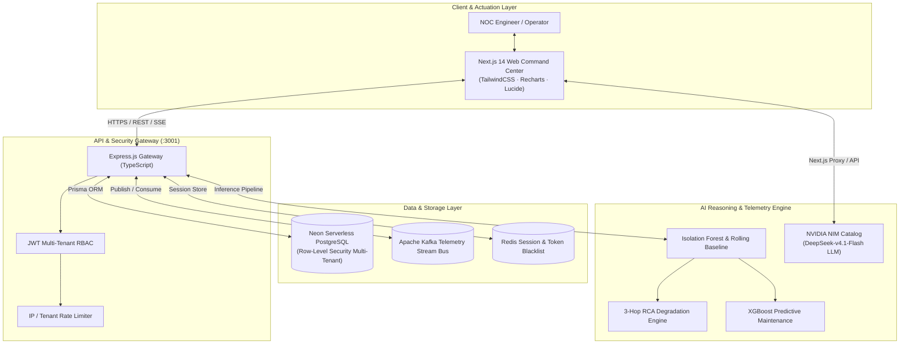
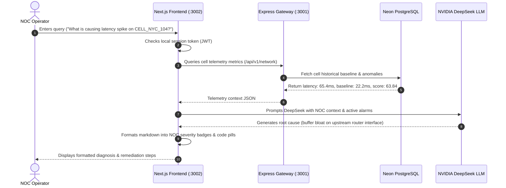

# Telecom AI Copilot & Autonomous NOC Operations Platform

> **Enterprise-grade, AI-driven Network Operations Center (NOC) and Autonomous Telemetry Platform for 4G-LTE and 5G-Standalone (5G-SA) Infrastructure.**

---

## 1. Executive Summary

The **Telecom AI Copilot** is a unified, production-ready observability, diagnostics, and remediation platform engineered for telecom operators, NOC engineers, and network administrators. 

By combining real-time streaming telemetry, statistical and machine learning anomaly detection models (Isolation Forest, Rolling Baseline), and advanced generative reasoning via **NVIDIA NIM (DeepSeek v4.1 Flash)**, the platform detects, investigates, correlates, and resolves network incidents before they escalate to subscriber-facing service outages.

---

## 2. High-Level Architecture



---

## 3. Technology Stack Matrix

| Tier | Component | Technology & Framework | Purpose |
| :--- | :--- | :--- | :--- |
| **Presentation** | Frontend Command Center | **Next.js 14** (App Router, React 18, TypeScript) | Responsive Dark NOC UI, live charts, Leaflet topology maps |
| **Styling** | UI Framework | **TailwindCSS**, Lucide Icons, Class Variance Authority | Telecom-grade high-contrast status badges and telemetry tables |
| **API Gateway** | Backend Microservice | **Node.js 20+**, **Express.js**, TypeScript | Multi-tenant auth, incident lifecycle, rate limiting, audit logging |
| **Database** | Relational Database | **PostgreSQL (Neon Serverless)**, Prisma ORM | Relational schema, tenants, users, cell topology, incidents |
| **Inference Engine** | Generative AI Copilot | **NVIDIA NIM Catalog**, OpenAI-compatible SDK | DeepSeek-v4.1-Flash for multimodal network reasoning |
| **Anomaly Engine** | Statistical & ML Models | **Scikit-learn (Isolation Forest)**, Rolling Baseline | Millisecond telemetry threshold analysis and drift detection |
| **Deployment** | Cloud Hosting | **Render Platform** (Free Tier Web Services) | Auto-deploy from GitHub with live health monitoring |

---

## 4. End-to-End Data Flow



---

## 5. Core Platform Modules & Pages

### 1. Operations Dashboard (`/dashboard`)
- **Macro KPIs**: Live gauges for Network Availability, Latency RTT, Packet Loss, and Active Incidents.
- **Topology Heatmap**: Geographic status distribution across North America, Europe, and Asia-Pacific.
- **Auto-Refresh**: Live telemetry updates every minute simulating active streaming.

### 2. Conversational AI Copilot (`/dashboard/copilot`)
- **NVIDIA DeepSeek Inference**: Low-latency responses with telecom-specific domain awareness.
- **Multimodal Support**: Operators can attach network diagrams, topology screenshots, or optical fiber traces.
- **Formatted Telemetry Display**: Automatically turns `CRITICAL`, `MAJOR`, and `MINOR` into colored status pills, converts code blocks into copyable snippets, and renders markdown tables.
- **Human-in-the-Loop Operational Gate**: Intercepts destructive actions (e.g. `reboot`, `shutdown`) and requests explicit operator authorization before execution.
- **Resilient Fallback Engine**: If upstream networks or LLM APIs experience latency, the built-in telemetry fallback immediately provides real-time diagnostics from the telemetry lake.

### 3. Anomaly Detection (`/dashboard/anomalies`)
- **ML Anomaly Sentry**: Powered by Isolation Forest and rolling standard deviation baseline algorithms.
- **Live Anomaly Feed**:
  - `CELL_NYC_104` (5G-SA): Latency anomaly (65.4ms vs 22.2ms baseline, Critical).
  - `CELL_LON_402` (4G-LTE): Throughput anomaly (12.2 Gbps vs 45.2 Gbps, Critical).
  - `CELL_SFO_201` (5G-SA): Packet loss anomaly (1.5% vs 0.13%, Critical).
- **Direct Investigation Link**: Single click transfers anomaly context directly to the AI Copilot for root cause analysis.

### 4. Incident Management & Root Cause Analysis (`/dashboard/incidents`)
- **Incident Lifecycle**: Track Open, In-Progress, and Resolved network issues.
- **"Declare Incident" Workflow**: Form to declare new P1-P4 incidents with impacted cell selection.
- **RCA Visualizer (`/dashboard/incidents/[id]/rca`)**:
  - 3-hop network degradation path visualization.
  - Multi-hypothesis evaluation matrix.
  - Recommended remediation playbooks.

### 5. Predictive Maintenance (`/dashboard/predictive-maintenance`)
- **Hardware Failure Forecasting**: Predicts radio unit thermal throttling, fiber attenuation, and power fluctuations.
- **Automated Dispatch**: Generates work orders and assigns field engineering teams.

### 6. Revenue Leakage & Fraud Prevention (`/dashboard/revenue-leakage`)
- **Billing Integrity**: Detects unmetered streaming sessions, SIM-box bypass fraud, and CDR anomalies.
- **Reconciliation Engine**: Calculates unbilled revenue and triggers automated billing adjustments.

### 7. Customer 360 & Sentiment Analytics (`/dashboard/customers/[id]`, `/dashboard/conversations`)
- **Subscriber Quality of Experience (QoE)**: Correlates cell-level degradation with individual subscriber churn risk.
- **Customer Interaction AI**: Natural language sentiment scoring of support transcripts.

### 8. Platform Governance & Multi-Tenancy (`/dashboard/admin/platform`, `/dashboard/admin/tenant`)
- **Row-Level Security (RLS)**: Enforces complete tenant isolation (`demo-tenant-001`).
- **Audit Logs**: Immutable record of all configuration changes and user actuations.

---

## 6. Security & Data Protection Architecture

1. **Cryptographic Multi-Tenancy**:
   - Every database query in Prisma includes `where: { tenantId }`.
   - Cross-tenant queries are blocked at both the Express Gateway and database layers.

2. **JWT-Based Authentication**:
   - Access tokens signed with HMAC-SHA256 (`JWT_SECRET`).
   - Cookie-based session storage with `SameSite=Lax` and `Secure` flags in production.

3. **Rate Limiting & DDoS Defense**:
   - Express rate limiters protect auth and API endpoints against brute force attacks.
   - Content Security Policy (CSP) restricts unauthorized third-party script injection.

4. **Secret Management**:
   - Zero hardcoded keys in version control. All API keys and connection strings are injected via runtime environment variables.

---

## 7. Deployment & Environment Setup

### Prerequisites
- Node.js `v20.x` or `v24.x`
- PostgreSQL instance (or Neon Serverless account)
- NVIDIA API Catalog key (optional, fallback included)

### Local Development Setup

#### 1. Clone the repository
```bash
git clone https://github.com/gautamd-sudo/Telecom-copoilt.git
cd Telecom-copoilt
```

#### 2. Backend Setup
```bash
cd backend
npm install
# Configure backend/.env
cp .env.example .env
# Push schema and seed data
npx prisma db push
npx ts-node prisma/seed.ts
# Start backend
npm start
```
*Backend runs on `http://localhost:3001`.*

#### 3. Frontend Setup
```bash
cd ../frontend
npm install
# Configure frontend/.env.local
cp .env.example .env.local
# Build and run
npm run build
npx next start -p 3002
```
*Frontend runs on `http://localhost:3002`.*

---

## 8. Live Production Deployment on Vercel & Render

| Service | Environment / URL | Status | Health Checks |
| :--- | :--- | :--- | :--- |
| **Frontend Web App (Vercel)** | [https://telecom-copilot-frontend.vercel.app](https://telecom-copilot-frontend.vercel.app) | **Live** | HTTP 200 (`/login`) |
| **Frontend Web App (Render)** | [https://telecom-copilot-frontend.onrender.com](https://telecom-copilot-frontend.onrender.com) | **Live** | HTTP 200 (`/login`) |
| **Backend REST API (Vercel)** | [https://telecom-copilot-backend.vercel.app](https://telecom-copilot-backend.vercel.app) | **Live** | [`/health`](https://telecom-copilot-backend.vercel.app/health) → `{"status":"UP"}`<br>[`/health/ready`](https://telecom-copilot-backend.vercel.app/health/ready) → `{"status":"READY"}` |
| **Backend REST API (Render)** | [https://telecom-copilot-backend.onrender.com](https://telecom-copilot-backend.onrender.com) | **Live** | [`/health`](https://telecom-copilot-backend.onrender.com/health) → `{"status":"UP"}`<br>[`/health/ready`](https://telecom-copilot-backend.onrender.com/health/ready) → `{"status":"READY"}` |
| **GitHub Repository** | [https://github.com/gautamd-sudo/Telecom-copoilt](https://github.com/gautamd-sudo/Telecom-copoilt) | **Synced** | Branch: `main` |

### Default Credentials (Pre-seeded in Neon DB)
- **Email**: `admin@acme.com`
- **Password**: `admin123!`
- **Tenant**: `Acme Telecom` (`demo-tenant-001`)
