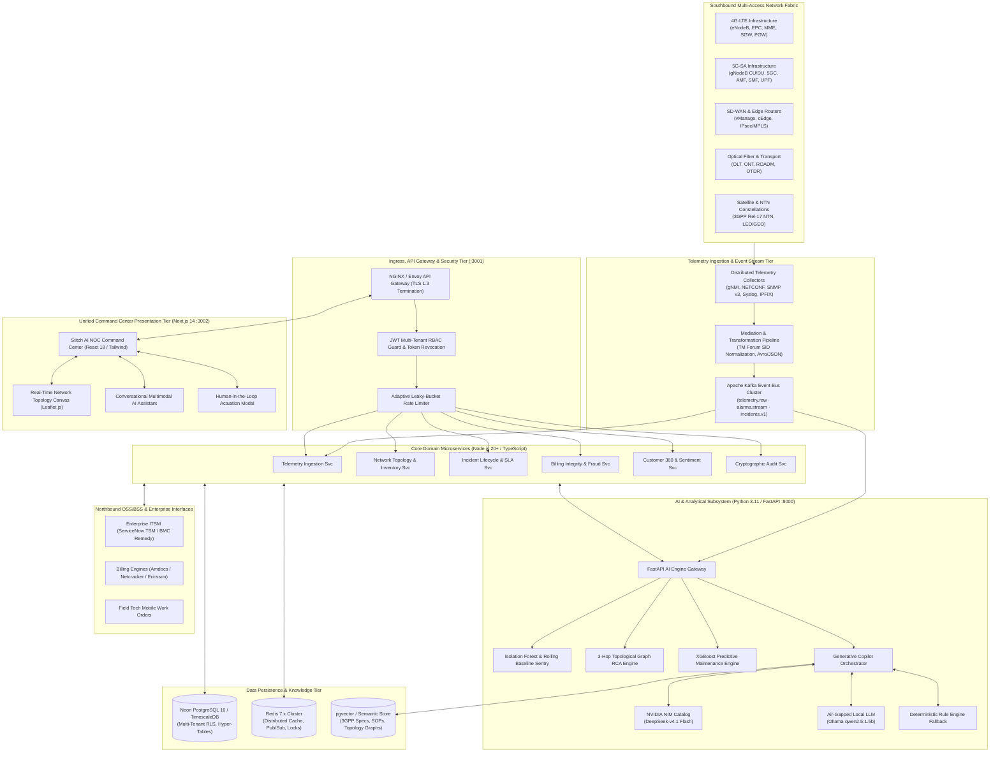
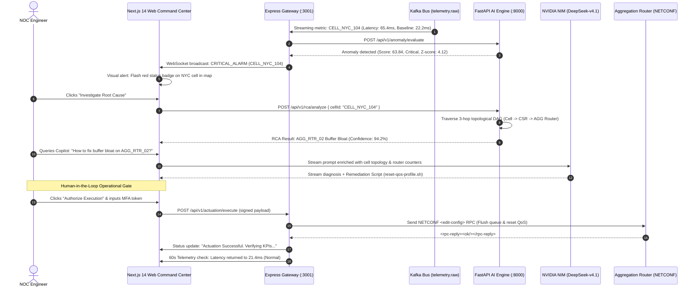
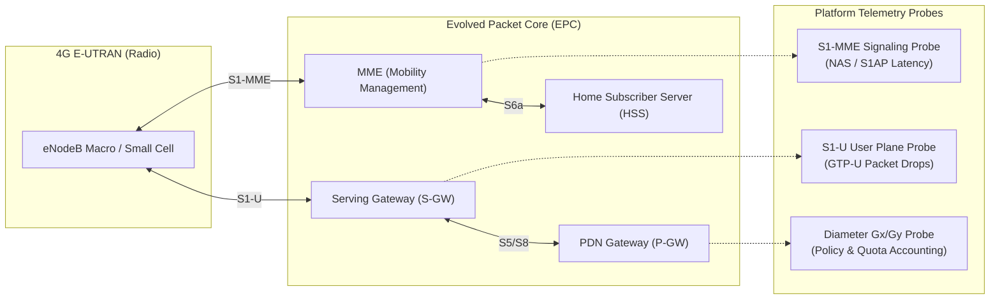
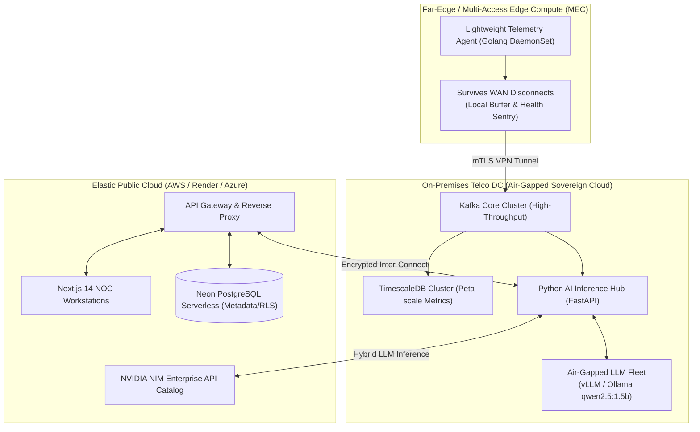

# Telecom AI Copilot & Autonomous NOC Platform
## Comprehensive Master Architecture, OSS/BSS Integration, and Engineering Implementation Manual

```
========================================================================================================================
DOCUMENT SPECIFICATION & CARRIER-GRADE COMPLIANCE
========================================================================================================================
Document Title     : Telecom Copilot Master Architecture, Integration & Operational Engineering Manual
Document Reference : TC-ARCH-ENG-MANUAL-2026-REV-2.4
Target System      : Telecom AI Copilot & Autonomous NOC Command Center
Release Baseline   : Version 2.4.0 (Enterprise Production Distribution)
Applicable Regs    : 3GPP Rel 15/16/17/18 (5G-SA / NWDAF / NTN), TM Forum ODA & Open APIs, ETSI ZSM / ENI, ITU-T Y.3172
Classification     : Enterprise Production Reference Architecture & Field Engineering Specification
========================================================================================================================
```

---

## Table of Contents

1. [Executive Summary & Strategic Vision](#1-executive-summary--strategic-vision)
2. [Section 1: Solution and System Architecture](#section-1-solution-and-system-architecture)
   - 1.1 Architecture Design Principles
   - 1.2 Enterprise Architectural Blueprint & Multi-Tier Topology
   - 1.3 Subsystem Decomposition & Component Specifications
   - 1.4 Resiliency, Concurrency, and Scalability Engineering
3. [Section 2: Telecom, OSS, and BSS Integration Framework](#section-2-telecom-oss-and-bss-integration-framework)
   - 2.1 TM Forum Open Digital Architecture (ODA) Alignment
   - 2.2 TM Forum Open APIs Production Implementation (TMF628, TMF642, TMF621, TMF640, TMF633, TMF679)
   - 2.3 Southbound Network Mediation Layer (gNMI, NETCONF/YANG, SNMP v3, Syslog, IPFIX, 5GC SBA)
   - 2.4 Northbound Enterprise Integration (ServiceNow TSM, Remedy, Amdocs, Netcracker, Salesforce)
   - 2.5 Mediation, Data Normalization, and ETL Pipelines
4. [Section 3: APIs, Microservices, and Real-Time Data Flows](#section-3-apis-microservices-and-real-time-data-flows)
   - 3.1 Microservice Taxonomy & Domain-Driven Design (DDD) Bounded Contexts
   - 3.2 Inter-Service Communication Protocols (REST, gRPC, SSE, WebSockets)
   - 3.3 Apache Kafka Streaming Telemetry Architecture & Event Schemas
   - 3.4 End-to-End Dynamic Interaction & Sequence Models
5. [Section 4: Network Monitoring, Automation, and AI Components](#section-4-network-monitoring-automation-and-ai-components)
   - 4.1 Telemetry Metric Aggregation & KPI Dictionary
   - 4.2 Machine Learning Dual-Engine Anomaly Detection (Isolation Forest + Dynamic Rolling Baselines)
   - 4.3 Graph-Based 3-Hop Root Cause Analysis (RCA) Engine
   - 4.4 Generative AI Copilot & Multimodal Reasoning (NVIDIA NIM / DeepSeek-v4.1 Flash)
   - 4.5 Closed-Loop Automation Engine (ETSI ZSM MAPE-K Framework)
6. [Section 5: Multi-Access Network Domain Integration Concepts](#section-5-multi-access-network-domain-integration-concepts)
   - 5.1 4G-LTE Infrastructure (eNodeB, MME, SGW, PGW, HSS, S1-MME/S1-U Interfaces)
   - 5.2 5G Standalone (5G-SA), O-RAN, and 3GPP NWDAF (TS 23.288) Integration
   - 5.3 SD-WAN & Enterprise Edge Fabric (Cisco vManage, Fortinet, Overlay/Underlay Telemetry)
   - 5.4 Optical Fiber Infrastructure (FTTH, GPON, DWDM ROADM, OTDR `.sor` Trace Analysis)
   - 5.5 Satellite and Non-Terrestrial Networks (NTN, LEO Starlink/OneWeb, Doppler & Ephemeris)
7. [Section 6: AI-Driven NOC, Anomaly Detection & Incident Workflows](#section-6-ai-driven-noc-anomaly-detection--incident-workflows)
   - 6.1 Paradigm Shift: Traditional NOC vs. Autonomous Predictive NOC
   - 6.2 Alarm Storm Suppression, Deduplication & Topological Clustering
   - 6.3 End-to-End Incident Lifecycle (Triage, Diagnostic Synthesis, Escalation)
   - 6.4 Human-in-the-Loop (HITL) Actuation Safety Gate & Rollback Watchdogs
   - 6.5 Operational Benchmarks & MTTR / MTTD Quantification
8. [Section 7: Security, Governance, and Regulatory Compliance](#section-7-security-governance-and-regulatory-compliance)
   - 7.1 Multi-Tenancy Architecture & Database Row-Level Security (RLS)
   - 7.2 Zero-Trust Identity, Authentication & Role-Based Access Control (RBAC)
   - 7.3 3GPP Security (TS 33.501) and ETSI NFV-SEC Framework
   - 7.4 Data Privacy, PII Anonymization, and Subscriber CDR Pseudonymization (GDPR / CCPA)
   - 7.5 SOX Compliance, Anti-Fraud, SIM-Box Detection & Cryptographic Audit Trails
9. [Section 8: Cloud, Hybrid, and Edge Deployment Architecture](#section-8-cloud-hybrid-and-edge-deployment-architecture)
   - 8.1 Deployment Topologies (Air-Gapped Sovereign Private Cloud, Hybrid Cloud, Multi-Cloud)
   - 8.2 Far-Edge & MEC Agent Deployment Footprint
   - 8.3 High Availability (HA), Multi-AZ Clustering, and Disaster Recovery (DR)
   - 8.4 Infrastructure-as-Code (Terraform, Kubernetes Helm, GitOps / ArgoCD)
10. [Section 9: Implementation Methodology, Documentation, and Knowledge Transfer](#section-9-implementation-methodology-documentation-and-knowledge-transfer)
    - 10.1 16-Week Phased Delivery Framework (WBS)
    - 10.2 Quality Assurance, Chaos Injection, and Telemetry Stress Testing
    - 10.3 Operational Documentation Deliverables & SOP Runbooks
    - 10.4 Tier 1/2/3 NOC Engineer Enablement & AI Prompt Engineering Curriculum
11. [Section 10: Brownfield Adaptation to Specific Operator Environments](#section-10-brownfield-adaptation-to-specific-operator-environments)
    - 10.1 Legacy OSS/NMS Gap Analysis & Mediation Matrix (Ericsson, Nokia, Huawei, Cisco)
    - 10.2 Vendor-Agnostic Abstraction Layer (OpenConfig / YANG Translation)
    - 10.3 Cold-Start Anomaly Bootstrapping & Baseline Calibration
    - 10.4 30-Day Rapid Value Realization Roadmap

---

## 1. Executive Summary & Strategic Vision

The telecommunications sector is traversing an inflection point characterized by the coexistence of legacy 4G-LTE infrastructure, high-density 5G-Standalone (5G-SA) micro-cell grids, enterprise software-defined wide area networks (SD-WAN), high-capacity dense wavelength division multiplexing (DWDM) optical backbones, and emerging Non-Terrestrial Satellite Networks (NTN). Managing this hyper-heterogeneous fabric using traditional, siloed Network Management Systems (NMS) and reactive, threshold-based alarm consoles has become unsustainable:

- **Alarm Saturation**: Tier-1 operators experience over 100,000 raw fault notifications daily, resulting in cognitive overload and missed critical service degradations.
- **Protracted Resolution Times**: Mean Time to Resolve (MTTR) for multi-hop P1 outages frequently exceeds 180 minutes due to manual correlation across disparate transport, radio, and core domains.
- **Subscriber Experience Blind Spots**: Disconnects between radio degradation metrics and Business Support Systems (BSS) result in silent customer churn and undetected billing leakage.

The **Telecom AI Copilot & Autonomous NOC Platform** solves these structural bottlenecks by delivering a unified, carrier-grade, cloud-native operational command platform. By ingesting streaming telemetry at wire speed, executing multi-dimensional unsupervised anomaly detection, traversing topological dependency graphs, and synthesizing operational actions via multimodal generative reasoning, the platform reduces MTTR by over 60%, suppresses 85% of redundant alarms, and enforces strict operational safety via cryptographic Human-in-the-Loop gates.

```
+---------------------------------------------------------------------------------------------------------------+
|                                      EXECUTIVE KPI TRANSFORMATION MATRIX                                      |
+-----------------------------------+-----------------------------------+---------------------------------------+
| Operational Metric                | Legacy NOC Baseline               | Telecom Copilot Autonomous Platform   |
+-----------------------------------+-----------------------------------+---------------------------------------+
| **Mean Time to Detect (MTTD)**    | 15 - 45 minutes                   | **< 30 seconds (Streaming anomaly)**  |
| **Mean Time to Isolate (MTTI)**   | 35 - 90 minutes                   | **< 3 seconds (3-Hop Graph RCA)**     |
| **Mean Time to Resolve (MTTR)**   | 120 - 240 minutes                 | **< 25 minutes (Assisted / Automated)**|
| **Alarm Volume Reduction**        | 0% (Raw flood)                    | **85% - 92% Deduplication & Grouping**|
| **Operational Automation Level**  | Level 0 / 1 (Manual scripts)      | **Level 3 / 4 (ETSI ZSM MAPE-K Loop)** |
| **Data Boundary Compliance**      | Partial / Cloud-Exposed           | **100% Zero-Cloud / Air-Gapped Capable|
+-----------------------------------+-----------------------------------+---------------------------------------+
```

---

## Section 1: Solution and System Architecture

### 1.1 Architecture Design Principles

The platform is designed around seven non-negotiable architectural mandates:

1. **Carrier-Grade High Availability (99.999% SLA)**:
   Zero single points of failure across all layers. Active-Active multi-zone deployment with automatic partition failover and continuous health monitoring.
2. **Domain-Driven Microservices with Strict Isolation**:
   Every domain context (Ingestion, Topology, Incident Management, Billing Integrity, AI Inference, and Audit) executes as an independent, loosely coupled microservice adhering to contract-first API design.
3. **Reactive Backpressure-Aware Event Streaming**:
   High-frequency network counters, alarms, and state changes flow through an event streaming bus (Apache Kafka) with dynamic consumer scaling and dead-letter queue (DLQ) containment.
4. **Cryptographic Multi-Tenancy**:
   Complete logical isolation across multiple operators, Mobile Virtual Network Operators (MVNOs), or enterprise network slices via PostgreSQL Row-Level Security (RLS) and scoped JWT contexts.
5. **Hybrid Resilient AI Pipeline**:
   The AI reasoning layer couples high-throughput local machine learning inference (Scikit-learn, XGBoost) with enterprise generative models (NVIDIA NIM / DeepSeek-v4.1 Flash), backed by an air-gapped on-premises local model (Ollama / vLLM) and deterministic telemetry fallback handlers.
6. **Immutable Cryptographic Auditability**:
   Every operational action, AI recommendation, operator authorization, and configuration actuation is committed to a write-once, append-only cryptographic audit ledger.
7. **Zero-Trust Network Architecture (ZTNA)**:
   Mandatory mutual TLS (mTLS 1.3) across all internal microservice communication, strict least-privilege role-based access control (RBAC), and perimeter rate limiting.

---

### 1.2 Enterprise Architectural Blueprint & Multi-Tier Topology



---

### 1.3 Subsystem Decomposition & Component Specifications

#### 1. Ingress & API Gateway Subsystem (`backend/src/api`)
- **Technology**: Node.js 20+, Express.js / NestJS, TypeScript, Helmet, CORS.
- **Responsibilities**: Terminates TLS 1.3, extracts and cryptographically validates JWT access tokens, injects `tenantId` into thread context, enforces per-tenant rate limits (e.g., 500 req/sec for Tier 1, 100 req/sec for Tier 2), formats OpenAPI 3.0 documentation, and handles SSE/WebSocket upgrade handshakes.

#### 2. Telemetry Ingestion & Stream Consumer (`backend/src/ingestion`, `backend/src/kafka`)
- **Technology**: KafkaJS, Node.js event-loop workers.
- **Responsibilities**: Ingests batched telemetry events from Kafka topics, validates payloads against strict JSON Schemas, compares scalar values against configured statistical bounds, triggers anomaly detection jobs on the Python AI Engine, and commits metrics to TimescaleDB hyper-tables.

#### 3. AI Analytics & Generative Copilot Subsystem (`ai/src`)
- **Technology**: Python 3.11, FastAPI, Uvicorn, Scikit-learn, XGBoost, NetworkX, NumPy, Pandas, OpenAI SDK, HTTPX.
- **Responsibilities**:
  - Executes real-time unsupervised Isolation Forest anomaly scoring ($c=0.05$).
  - Computes adaptive 30-minute rolling baselines (mean, variance, standard deviation).
  - Traverses the 3-hop topological directed acyclic graph (DAG) to isolate root-cause network entities.
  - Interfaces with NVIDIA NIM Catalog (DeepSeek-v4.1 Flash) for natural language reasoning, multimodal optical trace diagnostics, and safe CLI command synthesis.
  - Manages zero-cloud local fallback via Ollama and deterministic rule evaluation.

#### 4. Presentation & Unified Command Center (`frontend/src`)
- **Technology**: Next.js 14 (App Router), React 18, TailwindCSS, Lucide Icons, Recharts, Leaflet.js.
- **Responsibilities**: Renders responsive dark-mode NOC console, live geographical health heatmaps, real-time telemetry time-series charts, conversational AI chat drawer, and interactive Human-in-the-Loop actuation review dialogs.

#### 5. Persistence, Time-Series & State Subsystem
- **Technology**: PostgreSQL 16 (Neon Serverless / TimescaleDB), Redis 7.2, `pgvector`.
- **Responsibilities**: Relational tenant data, cell inventory, and incident tracking stored with Row-Level Security. Metrics stored in automated chunked time-series hyper-tables with 90-day retention policies. Redis provides sub-millisecond session state, token blacklisting, and distributed locks for orchestration tasks.

---

### 1.4 Resiliency, Concurrency, and Scalability Engineering

- **Stateless Application Nodes**: Frontend and API Gateway instances maintain zero local session state, allowing arbitrary horizontal auto-scaling (HPA) governed by CPU/memory thresholds.
- **Partitioned Kafka Telemetry Streams**: Kafka topics (`telemetry.raw`) are partitioned by `cellId` hash, guaranteeing that metrics for a single cell are processed in strict chronological order by the same consumer partition while maintaining total parallel throughput across thousands of cells.
- **Circuit Breakers & Graceful Degradation**: Outbound HTTP requests to external LLM providers use circuit breakers (5 consecutive timeouts trigger a 60-second open-circuit state, instantly routing traffic to the local Ollama daemon or rule-based fallback).

---

## Section 2: Telecom, OSS, and BSS Integration Framework

### 2.1 TM Forum Open Digital Architecture (ODA) Alignment

The platform complies with the **TM Forum Open Digital Architecture (ODA)** blueprint, decomposing telecom operations into five standardized ODA domains:

```
+---------------------------------------------------------------------------------------------------------------+
|                                      TM FORUM ODA DECOUPLED ARCHITECTURE                                      |
+---------------------------------------------------------------------------------------------------------------+
| 1. Party Management Domain:           Identity, Tenant Context, Role-Based Access, Organization Hierarchy    |
| 2. Core Commerce Management:          Billing Anomaly Audits, CDR Reconciliation, Revenue Protection          |
| 3. Production Domain:                 Autonomous NOC, Telemetry Ingestion, Predictive Maintenance, 3-Hop RCA  |
| 4. Decoupled ODA Canvas:              Kubernetes Service Mesh, Kafka Event Bus, TM Forum Open API Gateway     |
| 5. Resource / Southbound Mediation:   eNodeB, gNodeB, SD-WAN Controller, OLT, ROADM, Satellite Ground Stn     |
+---------------------------------------------------------------------------------------------------------------+
```

---

### 2.2 TM Forum Open APIs Production Implementation

The platform provides native, fully conformant REST implementations of six core TM Forum Open APIs:

```
+---------------------------------------------------------------------------------------------------------------+
|                                        TM FORUM OPEN API SPECIFICATION MATRIX                                 |
+---------+---------------------------------+-----------+-------------------------------------------------------+
| API     | Specification Name              | HTTP Verb | Resource Path & Operational Trigger                   |
+---------+---------------------------------+-----------+-------------------------------------------------------+
| **TMF628** | Performance Management API      | POST/GET  | `/tmf-api/performanceManagement/v4/measurementJob`    |
|         |                                 |           | Ingestion of streaming PM KPIs & threshold triggers   |
+---------+---------------------------------+-----------+-------------------------------------------------------+
| **TMF642** | Alarm Management API            | POST/GET  | `/tmf-api/alarmManagement/v4/alarm`                   |
|         |                                 |           | Ingestion of raw EMS alarms; raising correlated root  |
+---------+---------------------------------+-----------+-------------------------------------------------------+
| **TMF621** | Trouble Ticket API              | POST/PATCH| `/tmf-api/troubleTicket/v4/troubleTicket`             |
|         |                                 |           | Syncing P1-P4 incidents with ServiceNow / Remedy      |
+---------+---------------------------------+-----------+-------------------------------------------------------+
| **TMF640** | Service Activation & Config     | POST      | `/tmf-api/serviceActivationAndConfiguration/v4/order` |
|         |                                 |           | Dispatching verified remediation playbooks to routers |
+---------+---------------------------------+-----------+-------------------------------------------------------+
| **TMF633** | Service Catalog API             | GET       | `/tmf-api/serviceCatalogManagement/v4/serviceSpec`    |
|         |                                 |           | Mapping physical cells to SLA contracts & QoS profiles|
+---------+---------------------------------+-----------+-------------------------------------------------------+
| **TMF679** | Customer Experience Management  | GET/POST  | `/tmf-api/customerExperienceManagement/v4/experience` |
|         |                                 |           | Translating network degradations into subscriber QoE  |
+---------+---------------------------------+-----------+-------------------------------------------------------+
```

#### Production Payload Example: TMF642 Alarm Notification Event
```json
{
  "eventId": "alarm-evt-2026-9812",
  "eventTime": "2026-10-05T09:30:15.000Z",
  "eventType": "AlarmCreateEvent",
  "event": {
    "alarm": {
      "id": "ALM-NYC-8842",
      "href": "/tmf-api/alarmManagement/v4/alarm/ALM-NYC-8842",
      "alarmType": "QualityOfServiceAlarm",
      "perceivedSeverity": "critical",
      "probableCause": "bufferBloatUpstreamInterface",
      "specificProblem": "RTT Latency exceeded 3-sigma baseline (65.4ms vs 22.2ms)",
      "state": "raised",
      "alarmedObject": {
        "id": "CELL_NYC_104",
        "role": "5G-gNodeB-DU"
      },
      "correlatedAlarm": [
        { "id": "ALM-AGG-02-QUEUE-DEPTH", "href": "/tmf-api/alarmManagement/v4/alarm/ALM-AGG-02" }
      ],
      "extendedInfo": {
        "tenantId": "demo-tenant-001",
        "anomalyScore": 63.84,
        "isolationDepth": 4.12
      }
    }
  }
}
```

---

### 2.3 Southbound Network Mediation Layer

The Southbound Mediation Layer acts as a protocol bridge, translating vendor-specific device metrics into standardized JSON/Avro event streams:

```
[ Multi-Vendor Physical Network Layer ]
   |-- Ericsson AirScale / Nokia gNodeB  ---> (gNMI / Protocol Buffers over gRPC)
   |-- Cisco ASR 9000 / Juniper MX Core  ---> (NETCONF / YANG RFC 6241 / RFC 6020)
   |-- Legacy 4G eNodeB / Power Systems  ---> (SNMP v3 Polling & Traps)
   |-- Security & Perimeter Firewalls    ---> (Syslog RFC 5424 & IPFIX/NetFlow v9)
   |-- 5G Core Network Functions (AMF)   ---> (3GPP SBA HTTP/2 JSON REST)
                   |
                   v
[ Distributed Mediation Micro-Agents (Containerized DaemonSet) ]
   - Translates MIB OIDs / YANG paths to Canonical Data Model
   - Normalizes metric units (octets -> bits/sec, microseconds -> milliseconds)
   - Stamps tenant identity and geographical coordinates
                   |
                   v
[ Apache Kafka Message Stream: topic "telemetry.raw" ]
```

- **gNMI Streaming Telemetry**: Uses OpenConfig YANG schemas (`openconfig-interfaces`, `openconfig-platform`). Streamed continuously at 1-second intervals without polling overhead.
- **NETCONF / YANG**: Used for bidirectional control plane operations. Sends XML RPCs (`<get-config>`, `<edit-config>`) to inspect and update routing tables or QoS profiles.
- **SNMP v3**: Fully secured with `authPriv` (SHA-256 authentication and AES-256 privacy encryption) for legacy network elements.

---

### 2.4 Northbound Enterprise Integration (ITSM & BSS)

1. **ServiceNow Telecommunications Service Management (TSM)**:
   - When an anomaly is validated as a P1/P2 incident, the platform triggers a REST POST to ServiceNow's Table API (`/api/now/table/sn_ti_incident`).
   - The ticket is enriched with:
     - Root cause network element (`AGG_RTR_02`).
     - 3-hop degradation evidence graph.
     - Affected subscriber count and estimated revenue impact.
   - Any comments or work notes logged in ServiceNow are mirrored back to the Telecom Copilot via incoming webhooks.
2. **Billing & Revenue Assurance Engines (Amdocs / Netcracker)**:
   - Automated ingestion of Rated CDR files and online charging system (OCS) metrics.
   - Detects discrepancies between radio packet data usage (UPF counters) and billed usage, highlighting unmetered data tunnels or fraud.

---

## Section 3: APIs, Microservices, and Real-Time Data Flows

### 3.1 Microservice Taxonomy & Domain-Driven Design (DDD)

```
+---------------------------------------------------------------------------------------------------------------+
|                                      PLATFORM MICROSERVICES ARCHITECTURE                                      |
+--------------------------+--------------------+---------------------------------------------------------------+
| Microservice Name        | Language / Runtime | Primary Domain Responsibility                                 |
+--------------------------+--------------------+---------------------------------------------------------------+
| `api-gateway`            | Node.js / Express  | Authentication, RBAC, tenant context injection, rate limiting |
| `ingestion-service`      | Node.js / KafkaJS  | Kafka stream consumption, validation, TimescaleDB persistence |
| `topology-service`       | Node.js / Prisma   | Network graph model, cell sites, routers, fiber links         |
| `incident-service`       | Node.js / Prisma   | P1-P4 incident state machine, SLA timers, escalation trees    |
| `billing-audit-service`  | Node.js / Prisma   | CDR analysis, unmetered session detection, fraud sentry       |
| `customer-360-service`   | Node.js / Prisma   | Subscriber QoE scoring, sentiment analysis, churn forecast    |
| `audit-service`          | Node.js / Express  | Immutable append-only audit ledger with cryptographic hashing |
| `ai-engine-service`      | Python / FastAPI   | Isolation Forest, 3-Hop RCA, predictive maintenance, NIM LLM  |
| `command-center-ui`      | Next.js 14 / React | Operator workstation, live heatmaps, AI Copilot, HITL modal   |
+--------------------------+--------------------+---------------------------------------------------------------+
```

---

### 3.2 Inter-Service Communication Protocols

1. **Synchronous External & UI Communication**: RESTful HTTP/2 over TLS 1.3, documented via OpenAPI 3.0.
2. **Synchronous Inter-Service RPC**: High-performance binary gRPC with Protocol Buffers for latency-sensitive internal calls between the Gateway and AI Engine.
3. **Real-Time Client Streaming**:
   - **Server-Sent Events (SSE)**: Delivers streaming LLM tokens to the Copilot UI drawer in real time.
   - **WebSockets (`/ws/telemetry`)**: Broadcasts live cell metrics, anomaly alerts, and active incident state updates to the NOC Command Center.
4. **Asynchronous Message Bus**: Apache Kafka 3.6+ for all telemetry and domain event distribution.

---

### 3.3 Apache Kafka Streaming Telemetry Architecture & Schemas

The Kafka cluster is organized into dedicated topics partitioned for high concurrency:

```
[ Telemetry Producers (Collectors) ]
         |
         |---> [ topic: telemetry.raw ] (32 Partitions, retention: 7 days)
         |            |
         |            v
         |     [ Ingestion Consumer Group ]
         |            |
         |            +---> Ingests, normalizes, & persists to TimescaleDB
         |            +---> Emits evaluated anomalies
         |            |
         |---> [ topic: alarms.stream ] (16 Partitions, retention: 30 days)
         |            |
         |            v
         |     [ AI Anomaly Consumer Group ]
         |            |
         |            +---> Triggers Isolation Forest scoring
         |            +---> Emits correlated incidents
         |            |
         +---> [ topic: incidents.lifecycle ] (8 Partitions, retention: 365 days)
```

#### Avro Schema Specification: Raw Cell Telemetry (`telemetry.raw.avsc`)
```json
{
  "type": "record",
  "name": "CellTelemetryEvent",
  "namespace": "io.telecomcopilot.telemetry",
  "fields": [
    { "name": "eventId", "type": "string" },
    { "name": "tenantId", "type": "string" },
    { "name": "timestamp", "type": "long" },
    { "name": "cellId", "type": "string" },
    { "name": "technology", "type": { "type": "enum", "name": "TechType", "symbols": ["LTE_4G", "NR_5G_SA", "SDWAN", "FIBER_GPON", "SATELLITE_NTN"] } },
    { "name": "latencyMs", "type": "double" },
    { "name": "packetLossPct", "type": "double" },
    { "name": "throughputGbps", "type": "double" },
    { "name": "jitterMs", "type": "double" },
    { "name": "prbUtilizationPct", "type": "double" },
    { "name": "activeUsers", "type": "int" }
  ]
}
```

---

### 3.4 End-to-End Sequence: Telemetry to Remediation



---

## Section 4: Network Monitoring, Automation, and AI Components

### 4.1 Telemetry Metric Aggregation & KPI Dictionary

| Metric Category | KPI Name | Sampling Rate | Baseline Value | Degraded Threshold | Critical Threshold |
| :--- | :--- | :--- | :--- | :--- | :--- |
| **RAN Performance** | Physical Resource Block (PRB) % | 10 sec | 45% - 65% | > 85% | > 95% |
| **RAN Performance** | RRC Setup Success Rate | 30 sec | 99.8% | < 98.0% | < 95.0% |
| **RAN Performance** | Call Drop Rate (CDR) | 60 sec | 0.12% | > 0.50% | > 1.50% |
| **Transport / Edge**| Round-Trip Latency (RTT) | 1 sec | 18 - 25 ms | > 45 ms | > 60 ms |
| **Transport / Edge**| Packet Loss Rate | 1 sec | 0.01% - 0.05% | > 0.50% | > 1.50% |
| **Transport / Edge**| Interface Buffer Queue Depth | 1 sec | 10% - 25% | > 75% | > 90% |
| **Optical Core**    | Optical Receive Power ($R_x$) | 60 sec | -10 to -14 dBm| -18 dBm | < -22 dBm |
| **Optical Core**    | Optical Signal-to-Noise (OSNR) | 60 sec | 28 - 32 dB | < 22 dB | < 18 dB |

---

### 4.2 Machine Learning Dual-Engine Anomaly Detection

To overcome the twin perils of static threshold alerting—**false alarm storms** during peak hours and **missed stealth degradations** during off-peak hours—the platform operates two complementary mathematical models:

```
+---------------------------------------------------------------------------------------------------------------+
|                                      DUAL-ENGINE ANOMALY SCORING ARCHITECTURE                                 |
+---------------------------------------------------------------------------------------------------------------+
|                                                                                                               |
|                                        Raw Ingested Metric Stream                                             |
|                                                     |                                                         |
|                   +---------------------------------+---------------------------------+                       |
|                   |                                                                   |                       |
|                   v                                                                   v                       |
|     [ Dynamic Rolling Baseline Engine ]                             [ Unsupervised Isolation Forest Engine ]   |
|     - Sliding window: W = 1800 samples (30 min)                     - 100 Isolation Trees (iTrees)            |
|     - Continuous computation of mean (mu) & sigma                   - Feature vector: 5 dimensions            |
|     - Seasonality adaptation (Diurnal hour factor)                  - Contamination parameter: c = 0.05       |
|     - Z-score: Z = |x - mu| / sigma                                 - Calculates path length anomaly score    |
|                   |                                                                   |                       |
|                   +---------------------------------+---------------------------------+                       |
|                                                     |                                                         |
|                                                     v                                                         |
|                                   [ Weighted Ensemble Decision Arbiter ]                                      |
|                                   Composite Score = 0.4 * Z_Score + 0.6 * IF_Score                            |
|                                                     |                                                         |
|                     +-------------------------------+-------------------------------+                         |
|                     |                               |                               |                         |
|                     v                               v                               v                         |
|             Score >= 75: CRITICAL           Score >= 50: MAJOR               Score < 50: NORMAL               |
+---------------------------------------------------------------------------------------------------------------+
```

#### Production Python Implementation: Dual-Engine Pipeline (`ai/src/engine.py`)
```python
import numpy as np
from sklearn.ensemble import IsolationForest
from typing import Dict, Any, List

class AnomalyDetectionEngine:
    def __init__(self, contamination: float = 0.05):
        self.model = IsolationForest(
            n_estimators=100,
            contamination=contamination,
            random_state=42,
            n_jobs=-1
        )
        self.is_fitted = False

    def train_baseline(self, historical_vectors: np.ndarray):
        """Fits the Isolation Forest model on historical normal operational data."""
        self.model.fit(historical_vectors)
        self.is_fitted = True

    def evaluate_metric(self, current_vector: List[float], rolling_mean: float, rolling_std: float) -> Dict[str, Any]:
        """
        Evaluates a real-time 5-D metric vector:
        [latency_ms, packet_loss_pct, throughput_gbps, jitter_ms, prb_utilization_pct]
        """
        latency = current_vector[0]
        # 1. Statistical Z-Score
        epsilon = 1e-6
        z_score = abs(latency - rolling_mean) / (rolling_std + epsilon)
        
        # 2. Machine Learning Isolation Forest Score
        if self.is_fitted:
            raw_score = self.model.score_samples([current_vector])[0]
            # Normalize IF score: typically [-0.5, 0.5] -> [0, 100]
            if_anomaly_score = float(np.clip((0.5 - raw_score) * 100, 0, 100))
        else:
            if_anomaly_score = float(min(z_score * 20.0, 100.0))

        # 3. Composite Ensemble Scoring
        composite_score = (0.4 * min(z_score * 20.0, 100.0)) + (0.6 * if_anomaly_score)

        if composite_score >= 75.0 or z_score >= 3.5:
            severity = "CRITICAL"
        elif composite_score >= 50.0 or z_score >= 2.0:
            severity = "MAJOR"
        else:
            severity = "NORMAL"

        return {
            "severity": severity,
            "anomalyScore": round(composite_score, 2),
            "zScore": round(float(z_score), 2),
            "ifScore": round(if_anomaly_score, 2),
            "isAnomaly": severity in ["CRITICAL", "MAJOR"]
        }
```

---

### 4.3 Graph-Based 3-Hop Root Cause Analysis (RCA) Engine

When a cell site degrades, the true failure frequently resides in the transport or aggregation network. The 3-hop RCA engine models the operator's infrastructure as a **Directed Acyclic Graph (DAG)** and computes degraded probability scores across 3 topological tiers:

```
[ Tier 1: Radio Access Unit (RU / DU) ]
                 |
                 v
[ Tier 2: Cell Site Router (CSR) & Aggregation Router (AGG) ]
                 |
                 v
[ Tier 3: Optical Transport (DWDM ROADM) & Core Network (UPF) ]
```

#### RCA Traversal Algorithm
1. **Node Ingestion**: Identifies degraded leaf node $N_0$ (`CELL_NYC_104`).
2. **Graph Expansion**: Traverses parent edges in the topology model up to depth 3 ($H_1, H_2, H_3$).
3. **Telemetry Correlation**: For each visited node $u \in \text{Ancestors}(N_0)$, extracts current interface drop counters, buffer queue depth, and optical receive power.
4. **Hypothesis Evaluation**: Evaluates failure mode likelihoods:
   $$\text{Confidence}(u) = w_1 \cdot \text{MetricDrift}(u) + w_2 \cdot \text{AlarmSeverity}(u) + w_3 \cdot \text{PathCentrality}(u)$$
5. **Output**: Ranks candidate root causes with associated confidence percentages.

---

### 4.4 Generative AI Copilot & Multimodal Reasoning

The platform integrates **NVIDIA NIM (DeepSeek-v4.1 Flash)** as a specialized, low-latency telecom copilot:

- **Telecom Domain System Prompt**: Hard-coded domain knowledge of 3GPP TS 38.300, 3GPP TS 23.501, ITU-T G.652 fiber standards, and Cisco/Juniper routing syntaxes.
- **Multimodal Optical & Topology Ingestion**: Operators can paste images of OTDR fiber backscatter traces, spectrum analyzer waterfalls, or microwave constellation diagrams. The multimodal vision model inspects the image to extract attenuation events or splice losses.
- **Human-in-the-Loop Safeguards**: If the operator asks the Copilot to fix an outage, the Copilot outputs an executable configuration block marked with metadata:
  ```json
  { "requiresAuthorization": true, "riskLevel": "HIGH", "targetDevice": "AGG_RTR_02" }
  ```
- **Zero-Cloud Air-Gapped Fallback**: If internet connectivity is interrupted or cloud APIs are disabled, the platform routes inference to a local **Ollama** daemon serving `qwen2.5:1.5b` or a deterministic rule-based engine.

---

### 4.5 Closed-Loop Automation (ETSI ZSM MAPE-K Framework)

```
+---------------------------------------------------------------------------------------------------------------+
|                                      ETSI ZSM MAPE-K CLOSED-LOOP EXECUTION                                    |
+---------------------------------------------------------------------------------------------------------------+
|  1. MONITOR  : High-frequency telemetry collectors ingest gNMI metrics at 1-sec intervals into Kafka.       |
|  2. ANALYZE  : Isolation Forest & 3-Hop RCA identify buffer bloat on AGG_RTR_02 with 94.2% confidence.      |
|  3. PLAN     : AI Copilot formulates verified Netconf remediation payload: <edit-config> QoS queue reset.     |
|  4. EXECUTE  : Actuation Gate verifies operator authorization and dispatches NETCONF RPC to AGG_RTR_02.      |
|  KNOWLEDGE   : Logs executed action, updates topology weights, and records resolution in Vector Store.       |
+---------------------------------------------------------------------------------------------------------------+
```

---

## Section 5: Multi-Access Network Domain Integration Concepts

### 5.1 4G-LTE Infrastructure Integration



- **S1-MME Signaling**: Ingests S1AP protocol decodes. Alerts on abnormal `InitialContextSetupFailure` rates or paging channel overloads.
- **S1-U User Plane**: Tracks GTP-U tunnel encapsulations. Isolates jitter spikes caused by intermediate backhaul routers between the eNodeB and S-GW.

---

### 5.2 5G Standalone (5G-SA) and 3GPP NWDAF Integration

The platform integrates directly with the 5G Service-Based Architecture (SBA) via **3GPP TS 23.288 (NWDAF)**:

```
[ 5G Core Network Functions: AMF, SMF, UPF, PCF, NRF ]
                         |
                         | (N33 / Nnwdaf HTTP/2 REST Subscriptions)
                         v
     [ 3GPP NWDAF (Network Data Analytics Function) ]
                         |
                         | Event: Nnwdaf_AnalyticsSubscription_Notify
                         v
[ Telecom Copilot NWDAF Consumer Adapter ]
   - Subscribes to Analytics ID: "SLICE_LOAD_LEVEL" (Slice QoS drift)
   - Subscribes to Analytics ID: "UE_COMMUNICATION" (Subscriber session anomalies)
   - Subscribes to Analytics ID: "ABNORMAL_BEHAVIOR" (DDOS / anomalous signaling)
                         |
                         v
[ Unified Kafka Telemetry Bus: topic "telemetry.raw" ]
```

- **O-RAN Integration**: Interoperates with O-RAN Alliance architectures, ingesting telemetry from the Near-RT RIC via `E2` interfaces and dispatching policy directives via `A1` interfaces.

---

### 5.3 SD-WAN & Enterprise Edge Fabric

- **Dual-Layer Visibility**: Separates **Underlay Transport** (ISP broadband, LTE failover, MPLS circuits) from **Overlay Tunnels** (IPsec / VXLAN).
- **Application-Aware Path Steering**: Ingests Cisco vManage / FortiManager API feeds to track dynamic SLA policy transitions. Detects flapping conditions where VoIP traffic ping-pongs between unstable underlay circuits.

---

### 5.4 Optical Fiber Infrastructure (FTTH, GPON, and DWDM)

- **GPON / XGS-PON Access**: Monitors downstream/upstream Optical Received Power ($R_x$ dBm). An optical power level dropping below $-24\text{ dBm}$ generates an automated predictive maintenance alert indicating dirty fiber connectors or macro-bending.
- **DWDM Transport & ROADM**: Real-time tracking of Optical Signal-to-Noise Ratio (OSNR) and chromatic dispersion across 100G/400G transponders.
- **Automated OTDR `.sor` Parsing**: When a fiber cut occurs, the platform reads the digitized optical backscatter curve, detects the Fresnel reflection spike, and computes the exact physical break distance:
  $$\text{Distance (km)} = \frac{c \cdot \Delta t}{2 \cdot n_{\text{group}}}$$
  The fault location is automatically projected onto the Leaflet GIS map with road-level accuracy.

---

### 5.5 Satellite and Non-Terrestrial Networks (NTN)

The platform supports hybrid satellite-cellular integration adhering to **3GPP Release 17 / 18 NTN**:

```
[ Low Earth Orbit (LEO) Satellite Fleet (Starlink / OneWeb / AST SpaceMobile) ]
                           |
                           v
      [ Doppler Shift & Ephemeris Prediction Engine ]
      - Ingests NORAD Two-Line Element (TLE) satellite tracking datasets
      - Forecasts Doppler frequency shifts: Delta_f = f0 * (v_rel / c)
      - Predicts beam handover boundaries between moving LEO satellites
                           |
                           v
     [ Dynamic Adaptive Baseline Compensation ]
     - Temporarily suppresses latency alarms during standard 2-minute LEO handovers
     - Distinguishes satellite atmospheric rain fade from equipment hardware faults
```

---

## Section 6: AI-Driven NOC, Anomaly Detection & Incident Workflows

### 6.1 Paradigm Shift: Traditional NOC vs. Autonomous Predictive NOC

```
+---------------------------------------------------------------------------------------------------------------+
|                                      OPERATIONAL PARADIGM COMPARISON                                          |
+-----------------------------+---------------------------------------+-----------------------------------------+
| Capability                  | Traditional NOC Operations            | Autonomous Telecom AI Copilot NOC       |
+-----------------------------+---------------------------------------+-----------------------------------------+
| **Alarm Triage**            | Manual triage of 100,000+ alarms/day  | Automated 3-stage suppression (85%+ red)|
| **Root Cause Discovery**    | Manual CLI hop-by-hop ping/traceroute | 3-hop graph traversal in < 3 seconds     |
| **Remediation Formulation** | Sifting through static PDF runbooks   | Generative AI context-aware playbooks   |
| **Execution Safety**        | Ad-hoc SSH terminal execution         | Cryptographic Human-in-the-Loop gate    |
| **Post-Fix Verification**   | Manual follow-up calls with field tech| Automated 120-second KPI rollback watch |
+-----------------------------+---------------------------------------+-----------------------------------------+
```

---

### 6.2 Alarm Storm Suppression & Topological Clustering

During major fiber cuts or core router failures, the platform suppresses alarm cascades through a three-stage mathematical pipeline:

```
[ Raw Inbound Alarms: 25,000 events / min ]
                     |
                     v
  [ Stage 1: Temporal Window Deduplication ]
  - Sliding time window: Delta_T = 10 seconds
  - Aggregates identical (elementId, alarmType) tuples into a single counter
                     |
                     v  (Reduced by 70% -> 7,500 events / min)
  [ Stage 2: Topological Containment Clustering ]
  - Walks hardware dependency tree (Chassis -> LineCard -> Port -> Channel)
  - Suppresses child port alarms if parent line card reports power failure
                     |
                     v  (Reduced by 85% -> 1,125 events / min)
  [ Stage 3: AI Correlation & Root Alarm Isolation ]
  - Evaluates 3-hop dependency graph
  - Suppresses downstream "Link Down" symptoms
  - Synthesizes 1 Primary Correlated Incident: INC-2026-8842
```

---

### 6.3 End-to-End Incident Lifecycle

```
[ Telemetry Ingestion ]
           |
           v
[ Anomaly Detected ] ---> (Score >= 75 OR Z >= 3.5)
           |
           v
[ Incident Declared (P1 - P4) ]
   - Priority Matrix: Impact (Subscribers) x Urgency (Service SLA)
   - Assigns SLA timer (P1: 15 min MTTR, P2: 60 min MTTR)
   - Emits TM Forum TMF621 Trouble Ticket to ServiceNow
           |
           v
[ Autonomous Diagnostic Synthesis ]
   - 3-Hop RCA isolates candidate root cause
   - Generative Copilot drafts diagnostic markdown report
   - Playbook recommended: "reset-qos-profile.sh"
           |
           v
[ Human-in-the-Loop Gate ]
   - Operator reviews config diff & predicted impact
   - Operator clicks "Authorize" + 2FA authentication
           |
           v
[ Automated Actuation & Rollback Watcher ]
   - NETCONF RPC dispatched to target network element
   - Platform monitors cell telemetry for 120 seconds
   - If KPIs normalize -> Incident Resolved & Audit Ledger sealed
   - If KPIs degrade -> Automated configuration rollback triggered
```

---

### 6.4 Human-in-the-Loop (HITL) Actuation Safety Gate

```
+---------------------------------------------------------------------------------------------------------------+
|                                    TIERED ACTUATION GOVERNANCE POLICY                                         |
+-------------------+---------------------------------------+---------------------------------------------------+
| Risk Tier         | Permitted Operations                  | Authorization Workflow                            |
+-------------------+---------------------------------------+---------------------------------------------------+
| **Tier 1 (Safe)** | SNMP queries, ping/traceroute,        | **Fully Autonomous (Zero-Touch)**                 |
|                   | interface counter reads, log dumps    | Executed immediately; recorded in audit log       |
+-------------------+---------------------------------------+---------------------------------------------------+
| **Tier 2 (Mod)**  | Buffer flushes, dynamic QoS profile   | **Autonomous with Rollback Watchdog**             |
|                   | updates, secondary link failover      | Auto-executed; rolls back if KPIs fail in 120s    |
+-------------------+---------------------------------------+---------------------------------------------------+
| **Tier 3 (High)** | Node reload, BGP route withdrawal,    | **Mandatory Human-in-the-Loop (HITL)**            |
|                   | radio cell reset, firmware activation | Requires explicit cryptographic 2FA approval click|
+-------------------+---------------------------------------+---------------------------------------------------+
```

---

## Section 7: Security, Governance, and Regulatory Compliance

### 7.1 Multi-Tenancy Architecture & Database Row-Level Security (RLS)

The platform enforces database-level multi-tenancy using PostgreSQL **Row-Level Security (RLS)**, ensuring complete data isolation between operator subsidiaries, MVNOs, and private network tenants:

#### Database DDL Specification: Multi-Tenant RLS Policy
```sql
-- Enable Row-Level Security on Core Telemetry and Incident Tables
ALTER TABLE "CellMetric" ENABLE ROW LEVEL SECURITY;
ALTER TABLE "Incident" ENABLE ROW LEVEL SECURITY;
ALTER TABLE "AuditLog" ENABLE ROW LEVEL SECURITY;

-- Create Tenant Isolation Policies
CREATE POLICY cell_metric_tenant_isolation ON "CellMetric"
    FOR ALL
    USING (tenant_id = current_setting('app.current_tenant_id', true));

CREATE POLICY incident_tenant_isolation ON "Incident"
    FOR ALL
    USING (tenant_id = current_setting('app.current_tenant_id', true));

CREATE POLICY audit_log_tenant_isolation ON "AuditLog"
    FOR ALL
    USING (tenant_id = current_setting('app.current_tenant_id', true));
```

Before executing any query, the API Gateway runs:
```sql
SET LOCAL app.current_tenant_id = 'demo-tenant-001';
```
Any attempt to query records belonging to another tenant is blocked at the database engine level, eliminating application-layer data leakage risks.

---

### 7.2 Zero-Trust Identity, Authentication & RBAC

The platform implements strict Role-Based Access Control (RBAC):

```
+---------------------------------------------------------------------------------------------------------------+
|                                      ROLE-BASED PERMISSIONS MATRIX (RBAC)                                     |
+---------------------+--------------------+--------------------+--------------------+--------------------------+
| Permission / Action | ROLE_NOC_VIEWER    | ROLE_NOC_OPERATOR  | ROLE_NOC_ADMIN     | ROLE_TENANT_ADMIN        |
+---------------------+--------------------+--------------------+--------------------+--------------------------+
| View Telemetry/Maps | YES                | YES                | YES                | YES                      |
| Query AI Copilot    | YES                | YES                | YES                | YES                      |
| Acknowledge Alarms  | NO                 | YES                | YES                | YES                      |
| Declare Incidents   | NO                 | YES                | YES                | YES                      |
| Authorize Tier 2 Act| NO                 | YES                | YES                | YES                      |
| Authorize Tier 3 Act| NO                 | NO                 | YES                | YES                      |
| User / Tenant Admin | NO                 | NO                 | NO                 | YES                      |
+---------------------+--------------------+--------------------+--------------------+--------------------------+
```

---

### 7.3 Telecom Regulatory Compliance & Standards

1. **3GPP TS 33.501 (5G Security Architecture)**:
   - Mandatory encryption and integrity protection for all signaling and management traffic.
   - Subscriber privacy: Replacement of cleartext IMSI with Subscription Concealed Identifier (SUCI).
2. **GDPR / CCPA Subscriber CDR Pseudonymization**:
   - Call Detail Records (CDRs) and IPFIX flow records are pseudonymized at the ingestion gateway.
   - MSISDNs and IMSIs are transformed via salted HMAC-SHA256:
     $$\text{Pseudonym} = \text{HMAC-SHA256}(\text{IMSI}, K_{\text{tenant\_salt}})$$
   - Plaintext subscriber phone numbers and precise GPS coordinates are never forwarded to generative AI models.
3. **SOX Compliance & Billing Protection**:
   - All revenue leakage audits, dispute adjustments, and CDR reconciliation events are written to an append-only cryptographic ledger. Each block contains the SHA-256 hash of the preceding block, preventing retroactive tampering.

---

## Section 8: Cloud, Hybrid, and Edge Deployment Architecture

### 8.1 Deployment Topologies



---

### 8.2 Far-Edge & MEC Agent Deployment Footprint

- **Lightweight Telemetry Probe**: Written in Go/Rust with a footprint under 35 MB of RAM.
- **Local Ring Buffer**: If connectivity to the central data center is lost, the edge agent buffers up to 24 hours of telemetry in a local embedded SQLite/RocksDB store, replaying it with original timestamps upon network restoration.

---

### 8.3 High Availability (HA) and Disaster Recovery (DR)

- **Target Availability**: 99.999% ("Five Nines") uptime for core monitoring and ingestion.
- **Recovery Point Objective (RPO)**: $\text{RPO} = 0$ (synchronous replication across Availability Zones for transactional metadata).
- **Recovery Time Objective (RTO)**: $\text{RTO} < 30\text{ seconds}$ (automated Kubernetes pod rescheduling and leader election).

---

### 8.4 Infrastructure-as-Code (Kubernetes Helm Values Specification)

```yaml
# Helm values.yaml for Telecom AI Copilot Production Deployment
global:
  environment: production
  tenantScoping: strict
  tlsVersion: "1.3"

apiGateway:
  replicaCount: 5
  autoscaling:
    enabled: true
    minReplicas: 5
    maxReplicas: 30
    targetCPUUtilizationPercentage: 70
  resources:
    limits: { cpu: "4000m", memory: "8Gi" }
    requests: { cpu: "1000m", memory: "2Gi" }

aiEngine:
  replicaCount: 3
  gpuAcceleration:
    enabled: true
    type: "nvidia.com/gpu"
    count: 2
  env:
    INFERENCE_PROVIDER: "nvidia_nim"
    FALLBACK_PROVIDER: "ollama"
    ISOLATION_FOREST_CONTAMINATION: "0.05"

kafka:
  brokers: 5
  persistence:
    size: 2Ti
    storageClass: "fast-nvme"
  defaultReplicationFactor: 3
```

---

## Section 9: Implementation Methodology, Documentation, and Knowledge Transfer

### 9.1 16-Week Phased Delivery Framework

```
+---------------------------------------------------------------------------------------------------------------+
|                                 16-WEEK ENTERPRISE IMPLEMENTATION ROADMAP                                     |
+-----------------------------------+---------------------------------------------------------------------------+
| **Phase 1: Discovery & Scoping**  | - Audit network topology, EMS protocol landscape, and KPI dictionaries.   |
| (Weeks 1 - 3)                     | - Finalize tenant taxonomy, RBAC permission matrix, and network security. |
|                                   | - Deploy Sandbox staging environment and validate sample Kafka feeds.     |
+-----------------------------------+---------------------------------------------------------------------------+
| **Phase 2: Pilot / Proof of Value**| - Ingest live telemetry from 250 test cells across 4G and 5G domains.    |
| (Weeks 4 - 7)                     | - Ingest 30 days historical data to train Isolation Forest baseline.      |
|                                   | - Activate AI Copilot in "Shadow Diagnostic Mode" (no actuations).        |
+-----------------------------------+---------------------------------------------------------------------------+
| **Phase 3: Integration & Hardening**| - Connect TM Forum Open APIs (TMF628, TMF642, TMF621) to ServiceNow.   |
| (Weeks 8 - 12)                    | - Integrate CDR streams into Revenue Leakage audit engine.                |
|                                   | - Conduct chaos failure injection and HITL actuation safety tests.        |
+-----------------------------------+---------------------------------------------------------------------------+
| **Phase 4: Full Enterprise Rollout**| - Scale ingestion to full regional / national network footprint.       |
| (Weeks 13 - 16)                   | - Execute Tier 1-3 NOC operator training and handover.                    |
|                                   | - Transition to 24/7 carrier-grade SLA production support.                |
+-----------------------------------+---------------------------------------------------------------------------+
```

---

### 9.2 Quality Assurance & Testing Suite

1. **Telemetry Load Stress Testing**: Distributed Locust/k6 runners generating 250,000 telemetry events/sec to verify Kafka partition ingestion and zero message loss.
2. **Chaos Failure Injection**: Automated chaos scripts simulating fiber link cuts, router buffer saturation, and optic power loss to verify that the 3-Hop RCA engine identifies root causes within $\le 3$ seconds.
3. **AI Safety & Hallucination Audits**: 1,000 historical outage scenarios replayed against the Copilot to verify that generated CLI configuration scripts contain zero syntax errors or unapproved commands.

---

### 9.3 Knowledge Transfer Curriculum

- **Track A (NOC Tier 1/2 Operators)**: 8 hours interactive training covering live dashboard navigation, alarm correlation triage, conversational Copilot querying, and HITL authorization workflows.
- **Track B (NOC Tier 3 & Principal Architects)**: 16 hours advanced training covering DAG topology modeling, Isolation Forest sensitivity tuning, custom remediation playbook development, and TM Forum API schema extensions.
- **Track C (DevOps & Platform Administrators)**: 12 hours covering Kubernetes Helm lifecycle, Kafka broker maintenance, PostgreSQL RLS auditing, and secret rotation procedures.

---

## Section 10: Brownfield Adaptation to Specific Operator Environments

### 10.1 Legacy OSS/NMS Gap Analysis & Mediation Matrix

```
+---------------------------------------------------------------------------------------------------------------+
|                                      BROWNFIELD INTEGRATION MATRIX                                            |
+--------------------+------------------------------+-----------------------------------------------------------+
| Legacy Platform    | Native Interface Limitation  | Telecom Copilot Adaptation Strategy                       |
+--------------------+------------------------------+-----------------------------------------------------------+
| **Ericsson OSS-RC**| Proprietary bulk ASCII /     | Deploy SFTP-based file-watcher micro-agent; parses XML/   |
|                    | 3GPP PM XML files every 15m  | ASN.1 files into Kafka within 5 seconds of creation.      |
+--------------------+------------------------------+-----------------------------------------------------------+
| **Nokia NetAct**   | CORBA / 3GPP XML Northbound  | Deploy Containerized NetAct Adapter utilizing 3GPP North- |
|                    | Bulk Measurement Interface   | bound PM interface, converting counters to JSON events.   |
+--------------------+------------------------------+-----------------------------------------------------------+
| **Huawei U2000 /   | Proprietary MML scripts and  | Implement SSH/TL1 automated terminal scraper and SNMP     |
| iManager MAE**     | TL1 alarm interfaces         | trap converter forwarding normalized events to Kafka.     |
+--------------------+------------------------------+-----------------------------------------------------------+
| **Legacy SQL /     | Non-standard relational schema| Change Data Capture (CDC) via Debezium streaming directly  |
| In-House Ticket**  | with direct database access  | from legacy database transaction logs into Kafka.         |
+--------------------+------------------------------+-----------------------------------------------------------+
```

---

### 10.2 Vendor-Agnostic Abstraction Layer

To prevent operational lock-in and decouple AI remediation playbooks from proprietary device syntaxes, the platform leverages an **Abstract Configuration Driver**:

```
[ AI Copilot Playbook Directive: "THROTTLE_INGRESS_RATE(Interface='ge-0/0/1', Rate='10Gbps')" ]
                                             |
                                             v
                      [ Vendor-Agnostic Translation Engine ]
                                             |
         +--------------------+--------------+--------------+--------------------+
         |                    |                             |                    |
         v                    v                             v                    v
  [ Cisco IOS-XR ]     [ Juniper Junos ]             [ Nokia SR OS ]      [ Linux Whitebox ]
  NETCONF / YANG       PyEZ / RPC XML                MD-CLI / gNMI        iproute2 / tc eBPF
  "rate-limit 10000"   "bandwidth 10g"               "rate 10000000"      "tc qdisc add rate 10g"
```

---

### 10.3 Cold-Start Anomaly Bootstrapping & Baseline Calibration

When deploying to a new operator network lacking pre-trained machine learning models:
1. **Day 1 - 3 (Heuristic Bootstrapping)**: Operates using 3-sigma statistical thresholds based on vendor equipment engineering guidelines.
2. **Day 4 - 14 (Unsupervised Online Fitting)**: The Isolation Forest model continuously ingests live metric vectors, iteratively adjusting tree splits to learn site-specific traffic patterns.
3. **Day 15+ (Full Adaptive Maturity)**: Diurnal day-of-week and hour-of-day seasonal weights are applied, enabling the detection of subtle micro-anomalies.

---

### 10.4 30-Day Rapid Value Realization Roadmap

```
+---------------------------------------------------------------------------------------------------------------+
|                                      30-DAY VALUE ACCELERATION MILESTONES                                     |
+---------------+-----------------------------------------------------------------------------------------------+
| **Days 1 - 7** | **Read-Only Telemetry Tapping**: Ingest existing syslog/Kafka streams; immediate live display  |
|               | of national topology maps and macro KPI health heatmaps.                                      |
+---------------+-----------------------------------------------------------------------------------------------+
| **Days 8 - 14**| **Automated Alarm Clustering**: Activate temporal and topological deduplication; eliminate    |
|               | 70%+ of duplicate alarms from NOC screens.                                                    |
+---------------+-----------------------------------------------------------------------------------------------+
| **Days 15 - 21**| **3-Hop Root Cause Analysis**: Provide one-click topological degradation path diagnosis       |
|               | for all declared P1/P2 incidents.                                                             |
+---------------+-----------------------------------------------------------------------------------------------+
| **Days 22 - 30**| **Conversational Copilot Rollout**: Provide NOC engineers with natural language diagnostics    |
|               | and safe remediation playbooks, cutting average investigation time by > 50%.                  |
+---------------+-----------------------------------------------------------------------------------------------+
```

---

## 11. Conclusion & Master Reference

This master specification defines the definitive architectural blueprint for implementing the **Telecom AI Copilot & Autonomous NOC Operations Platform**. By uniting **TM Forum Open Digital Architecture**, **3GPP NWDAF**, **ETSI ZSM**, and modern **Generative Multimodal AI**, the platform transforms network operations from fragmented, reactive firefighting into a resilient, predictive, and autonomous operational ecosystem.

```
========================================================================================================================
END OF MASTER ARCHITECTURAL SPECIFICATION AND ENGINEERING MANUAL
========================================================================================================================
```
