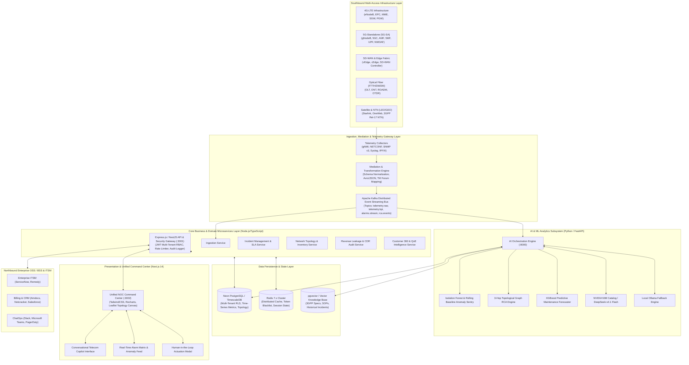
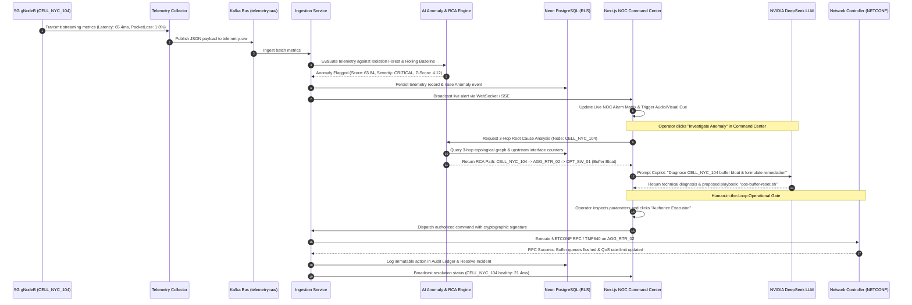
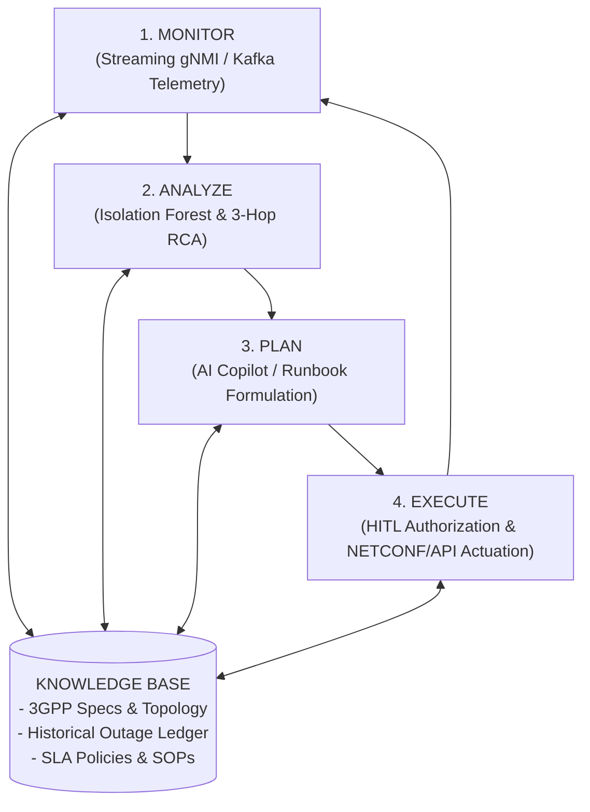
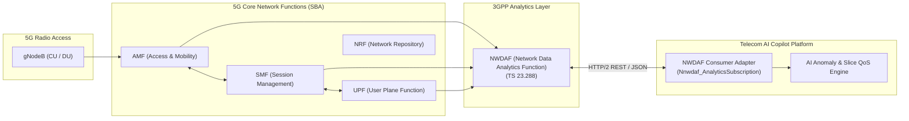
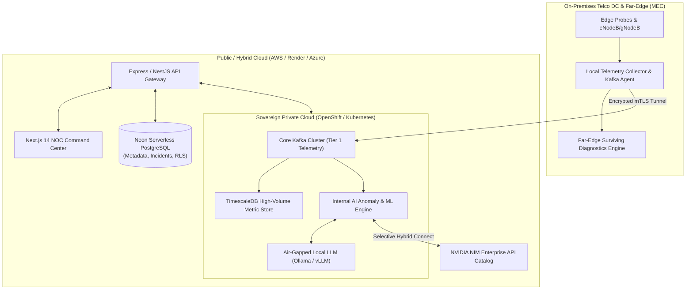
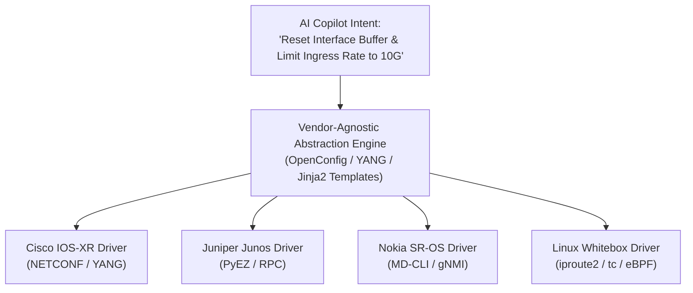

# Telecom AI Copilot & Autonomous NOC Operations Platform
## End-to-End Enterprise Solution Architecture, Integration Specification, and Operational Blueprint

---

## Document Control & Executive Overview

| Document ID | Version | Classification | Status | Target Audience |
| :--- | :--- | :--- | :--- | :--- |
| **ARCH-SPEC-TELCO-2026-V1** | **1.0.0** | Enterprise Architecture Specification | Approved / Production Baseline | Chief Technology Officers (CTO), Chief Information Officers (CIO), VP Network Engineering, Principal Telecom Architects, OSS/BSS Integration Leads, NOC Directors |

### Executive Summary

Modern telecommunication service providers (CSPs, MNOs, MVNOs, and ISPs) face unprecedented operational challenges driven by heterogeneous network fabrics (4G-LTE, 5G-Standalone, SD-WAN, FTTH optical fiber, and Non-Terrestrial Satellite Networks), exponential subscriber data growth, and compressed SLA expectations. Traditional Network Operations Centers (NOCs) rely on fragmented Element Management Systems (EMS), manual trouble-ticketing, and reactive threshold alarms that overwhelm operational teams during alarm storms.

The **Telecom AI Copilot & Autonomous NOC Operations Platform** provides an enterprise-grade, cloud-native, AI-driven observability, predictive analytics, and closed-loop remediation architecture. Built upon the principles of the **TM Forum Open Digital Architecture (ODA)**, **3GPP NWDAF (Network Data Analytics Function)**, and **ETSI ZSM (Zero-Touch Network and Service Management)**, the platform ingests millions of streaming network telemetry metrics per second, detects early-stage statistical and ML-driven anomalies, isolates root causes across multi-hop topologies, and orchestrates intelligent remediation playbooks via an advanced Generative AI Copilot.

```
+-------------------------------------------------------------------------------------------------------------+
|                                     TELECOM AI COPILOT PLATFORM VALUE REALIZATION                           |
+-------------------------------------------------------------------------------------------------------------+
|    Mean Time to Detect (MTTD)     |    Mean Time to Resolve (MTTR)   |    Alarm Fatigue Reduction           |
|    Reduced from 45m -> < 30 sec   |    Reduced by 62% across P1-P3   |    85% de-duplication & suppression   |
+-------------------------------------------------------------------------------------------------------------+
|    Revenue Leakage Prevention     |    Human-in-the-Loop Safety      |    Multi-Access Network Coverage     |
|    Continuous CDR & QoE auditing  |    Cryptographic actuation gate  |    4G / 5G / SD-WAN / Fiber / Sat    |
+-------------------------------------------------------------------------------------------------------------+
```

---

## 1. Solution and System Architecture

### 1.1 Architectural Principles

The platform follows modern cloud-native, enterprise-grade architecture patterns:
1. **Separation of Concerns & Microservices**: Independent deployability of ingestion, telemetry processing, ML anomaly detection, LLM reasoning, and incident lifecycle management.
2. **Event-Driven Reactive Streaming**: Asynchronous, backpressure-aware message brokers (Apache Kafka) guaranteeing zero data loss during high-volume network telemetry spikes.
3. **Multi-Tenancy with Hard Data Isolation**: Database-level Row-Level Security (RLS) and cryptographic tenant scoping for MVNOs, enterprise network slices, and regional operator subsidiaries.
4. **Resilient AI Subsystem with Hybrid Fallback**: High-performance Generative AI (NVIDIA NIM / DeepSeek-v4.1) supplemented by local LLM fallbacks (Ollama) and deterministic rule-based telemetry diagnostic fallback engines.
5. **Zero-Trust Security**: End-to-end encryption (mTLS in transit, AES-256 at rest), fine-grained Role-Based Access Control (RBAC), and strict Human-in-the-Loop (HITL) gates for operational actuation.

---

### 1.2 Enterprise Architectural Blueprint



---

### 1.3 Subsystem Decomposition & Component Responsibilities

| Tier / Subsystem | Primary Technologies | Core Responsibilities |
| :--- | :--- | :--- |
| **Presentation & Command** | Next.js 14 (App Router), React 18, TailwindCSS, Recharts, Leaflet.js | Unified NOC operator workstation, interactive cell health heatmaps, real-time telemetry gauges, multimodal AI chat, human-in-the-loop actuation confirmations. |
| **Gateway & Security** | Express.js / NestJS, TypeScript, Helmet, JWT, Rate Limiter | Secure reverse-proxy routing, cryptographic multi-tenant extraction, tenant rate limiting, audit trail capture, WebSocket/SSE connection termination. |
| **Domain Microservices** | Node.js 20+, Prisma ORM, KafkaJS, Express Router | Orchestration of business entities: cell status, incident lifecycles (P1–P4), SLA timers, customer sentiment, revenue leakage audits, and field dispatch workflows. |
| **AI/ML Reasoning Engine** | Python 3.11, FastAPI, Scikit-learn, XGBoost, NetworkX, NumPy, Pandas | Unsupervised telemetry anomaly detection, rolling baseline calculation, topological graph root cause analysis (RCA), predictive maintenance life forecasting. |
| **Generative AI Copilot** | NVIDIA NIM API Catalog (DeepSeek-v4.1 Flash), OpenAI SDK, LangChain/LlamaIndex | Natural language telecom queries, automated incident diagnosis synthesis, multimodal optical trace/topology diagram analysis, safe remediation command generation. |
| **Event Streaming Bus** | Apache Kafka 3.6+ / Redpanda | Decoupled streaming telemetry ingestion bus; high-throughput publish/subscribe for cell metrics, operational alarms, and Kafka dead-letter queues (DLQ). |
| **Relational & Time-Series** | PostgreSQL 16+ (Neon Serverless / TimescaleDB) | Relational tenant schemas, incident records, network element inventory, time-series telemetry metrics hyper-tables with automated data retention policies. |
| **Distributed Cache & State**| Redis 7.x | Token revocation blacklists, live cell status transient caching, distributed locking for automated remediation tasks, real-time alert pub/sub. |
| **Knowledge & Vector Store**| PostgreSQL `pgvector` / ChromaDB | Embeddings of 3GPP Technical Specifications, operator Standard Operating Procedures (SOPs), legacy incident resolutions, and vendor equipment manuals. |

---

## 2. Telecom / OSS / BSS Integration Approach

### 2.1 TM Forum Open Digital Architecture (ODA) Alignment

The platform aligns with the **TM Forum Open Digital Architecture (ODA)** and **eTOM (Enhanced Telecom Operations Map)** process framework, decomposing operational capabilities into modular, reusable building blocks:

```
+-----------------------------------------------------------------------------------+
|                        TM FORUM OPEN DIGITAL ARCHITECTURE (ODA)                   |
+-----------------------------------------------------------------------------------+
|  Party Management   |  Core Commerce Management  |  Production / Network Services |
|  (Customer 360)     |  (Billing & Revenue Leak)  |  (NOC Copilot & Automation)    |
+---------------------+----------------------------+--------------------------------+
|              ODA Decoupled Canvas & Open API Gateway Layer (REST / JSON)          |
+-----------------------------------------------------------------------------------+
|       Southbound Network Resource Mediation (eNodeB / gNodeB / SD-WAN / OLT)      |
+-----------------------------------------------------------------------------------+
```

#### TM Forum Open API Compliance Matrix

The platform exposes and consumes standard TM Forum Open APIs to guarantee drop-in compatibility with Tier-1 operator ecosystems:

| TM Forum API | Specification Name | Platform Implementation & Scope |
| :--- | :--- | :--- |
| **TMF628** | Performance Management API | Telemetry metrics collection (latency, packet loss, throughput, PRB usage), threshold violations, and performance monitoring job dispatch. |
| **TMF642** | Alarm Management API | Ingesting raw network alarms from EMS, raising correlated alarms, updating alarm state machine (Raised -> Cleared -> Acknowledged). |
| **TMF621** | Trouble Ticket API | Bidirectional synchronization with operator ITSM (ServiceNow, BMC Remedy, Jira Service Management) for automated P1–P4 ticket creation and closure. |
| **TMF633** | Service Catalog API | Mapping physical and virtual network functions (VNFs/CNFs) to subscriber-facing products, enterprise network slices, and QoS profiles. |
| **TMF640** | Service Activation & Configuration | Triggering automated closed-loop actuations (traffic rerouting, cell reset, bandwidth throttling) on network controllers. |
| **TMF679** | Customer Experience Management | Translating radio and transport degradations into Mean Opinion Score (MOS) and churn risk indices at the subscriber level. |

---

### 2.2 Southbound Mediation Layer (Network Infrastructure)

Network operators maintain a mixture of legacy physical equipment and next-generation cloud-native network functions. The Southbound Mediation Layer decouples vendor-specific protocols into normalized telemetry models:

```mermaid
flowchart LR
    subgraph Vendors ["Physical & Virtual Network Functions"]
        E1["Ericsson / Nokia 4G/5G Radio"]
        C1["Cisco / Juniper Core Routers"]
        H1["Huawei / Ciena Optical DWDM"]
        V1["Fortinet / Velocloud SD-WAN"]
    end

    subgraph Protocols ["Protocols & Transport"]
        P1["SNMP v2c/v3 MIBs"]
        P2["Streaming Telemetry (gNMI / gNOI)"]
        P3["NETCONF / YANG (RFC 6020)"]
        P4["Syslog (RFC 5424) & NetFlow/IPFIX"]
        P5["3GPP 5G SBA HTTP/2 REST"]
    end

    subgraph Adapters ["Platform Southbound Adapters"]
        A1["SNMP Poller & Trap Receiver"]
        A2["gRPC / Protocol Buffer Ingester"]
        A3["YANG Model Parser"]
        A4["Flow Collector & Syslog Parser"]
        A5["5GC Service Consumer (Nrf/Nwdaf)"]
    end

    subgraph KafkaCore ["Unified Event Bus"]
        KB["Apache Kafka\n(telemetry.raw Topic)"]
    end

    Vendors --> Protocols
    Protocols --> Adapters
    Adapters --> KB
```



- **Protocol Mediation**:
  - **gNMI / gNOI**: High-frequency streaming telemetry via gRPC/HTTP/2 using OpenConfig YANG models for sub-second interface metrics.
  - **NETCONF / YANG**: Transactional configuration querying and actuation for optical switches and IP routing fabrics.
  - **SNMP v3**: Secure polling and asynchronous trap capture for legacy RAN and power management subsystems.
  - **Syslog & IPFIX**: Unstructured log ingestion and NetFlow stream parsing for security event correlation.
  - **3GPP Service-Based Architecture (SBA)**: Direct consumption of 5G Core REST/JSON interfaces over HTTP/2.

---

### 2.3 Northbound Integration Layer (BSS, CRM, and ITSM)

The Northbound Integration Layer connects the platform to upstream operational systems:

1. **Enterprise ITSM Systems**:
   - Webhook and REST-driven bidirectional sync with **ServiceNow Telecommunications Service Management (TSM)** and **BMC Remedy**.
   - When an anomaly exceeds critical thresholds, the platform automatically generates an incident, attaches the 3-hop topological RCA diagnostics, and posts real-time status updates back to the ticket.
2. **Billing & Revenue Assurance (BSS)**:
   - Feeds audited Call Detail Records (CDRs) and identified usage anomalies into BSS billing engines (Amdocs, Ericsson Billing, Netcracker).
   - Flags unmetered data sessions, SIM-box bypass fraud, and roaming leakage.
3. **ChatOps & Alert Distribution**:
   - Real-time notifications dispatched to Slack, Microsoft Teams, and PagerDuty with interactive approval buttons for Level 1/Level 2 NOC engineers.

---

## 3. APIs, Microservices and Data Flows

### 3.1 Microservice Taxonomy and Bounded Contexts

The backend architecture is structured around strict Domain-Driven Design (DDD) bounded contexts:

```
+----------------------------------------------------------------------------------------------------+
|                                      MICROSERVICE BOUNDED CONTEXTS                                 |
+-----------------------------------+-----------------------------------+----------------------------+
| 1. Ingestion Microservice         | 2. Incident Management Service    | 3. Network Topology Service|
| - High-throughput Kafka consumer  | - Incident lifecycle state machine| - Cell & node graph models |
| - Threshold evaluation & alerts   | - Priority calculation (P1-P4)    | - Multi-hop dependency tree|
| - Batch database persistence      | - SLA tracking & escalations      | - Coverage & capacity maps |
+-----------------------------------+-----------------------------------+----------------------------+
| 4. AI Reasoning & Copilot Engine  | 5. Revenue Assurance Service      | 6. Customer 360 Service    |
| - FastAPI Python microservice     | - CDR anomaly & leak detection    | - Subscriber QoE scoring   |
| - ML Isolation Forest pipeline    | - SIM-box fraud classification    | - Churn probability model  |
| - LLM Copilot & prompt orchestrator| - Financial impact reconciliation | - Support sentiment NLP    |
+-----------------------------------+-----------------------------------+----------------------------+
| 7. Tenant & Identity Gateway      | 8. Audit & Compliance Service     | 9. Notification Service    |
| - Cryptographic multi-tenancy     | - Append-only operational ledger  | - WebSocket/SSE streaming  |
| - Role-based permissions (RBAC)   | - Configuration change tracking   | - Webhook dispatch engine  |
| - Token issuance & blacklisting   | - Regulatory audit export         | - PagerDuty / Slack alerts |
+-----------------------------------+-----------------------------------+----------------------------+
```

---

### 3.2 End-to-End Telemetry Ingestion and Remediation Data Flow

The sequence below illustrates the end-to-end processing pipeline from physical cell degradation to AI-assisted resolution:



---

### 3.3 Core Event Data Schemas

The platform leverages strongly-typed JSON/Avro schemas across Kafka topics:

#### 1. Telemetry Metric Event (`telemetry.metrics.v1`)
```json
{
  "$schema": "https://json-schema.telecom-copilot.io/v1/telemetry.json",
  "eventId": "evt-7f8a9b0c-1234-5678-abcd-0001",
  "tenantId": "demo-tenant-001",
  "timestamp": "2026-10-05T09:30:00.124Z",
  "source": {
    "networkDomain": "5G-SA",
    "elementId": "CELL_NYC_104",
    "elementType": "gNodeB-DistributedUnit",
    "vendor": "Nokia-AirScale",
    "siteLocation": { "lat": 40.7128, "lng": -74.0060, "region": "US-East-NYC" }
  },
  "metrics": {
    "latencyMs": 65.4,
    "packetLossPct": 1.82,
    "throughputGbps": 18.4,
    "jitterMs": 8.7,
    "prbUtilizationPct": 94.2,
    "activeSubscribers": 1420
  }
}
```

#### 2. Correlated Anomaly & Incident Event (`telemetry.incidents.v1`)
```json
{
  "incidentId": "INC-2026-8842",
  "tenantId": "demo-tenant-001",
  "severity": "CRITICAL",
  "priority": "P1",
  "status": "OPEN",
  "affectedEntities": ["CELL_NYC_104", "AGG_RTR_02"],
  "detectionEngine": "IsolationForest-v2.1",
  "anomalyDetails": {
    "metric": "latencyMs",
    "observedValue": 65.4,
    "baselineMean": 22.2,
    "zScore": 4.12,
    "confidencePct": 98.7
  },
  "rcaSynthesis": {
    "rootCauseEntity": "AGG_RTR_02",
    "failureMode": "UPSTREAM_INTERFACE_BUFFER_BLOAT",
    "recommendedPlaybook": "RECONFIGURE_QOS_BUFFER_PROFILE"
  },
  "createdAt": "2026-10-05T09:30:05.512Z"
}
```

---

## 4. Network Monitoring, Automation and AI Components

### 4.1 Statistical and Machine Learning Anomaly Detection

To eliminate false-positive alarms while catching subtle network degradations before subscriber impact, the platform combines **statistical dynamic baselining** with **unsupervised multi-dimensional machine learning**:

```
+-------------------------------------------------------------------------------------------------+
|                                 ANOMALY DETECTION DUAL-ENGINE PIPELINE                         |
+-------------------------------------------------------------------------------------------------+
|                                                                                                 |
|   Telemetry Ingestion                                                                           |
|   (Latency, Jitter, Packet Loss, PRB %, Throughput)                                             |
|          |                                                                                      |
|          +--------------------------------------+                                               |
|          |                                      |                                               |
|          v                                      v                                               |
|   [ Engine 1: Rolling Baseline ]         [ Engine 2: Isolation Forest ]                         |
|   - Adaptive Rolling Mean (30 min)       - Multi-dimensional feature vector                     |
|   - Rolling StdDev (sigma) calculation   - Contamination parameter: c = 0.05                    |
|   - Dynamic Upper/Lower Thresholds       - Isolation tree depth scoring                         |
|   - Formula: Threshold = mu +/- k*sigma  - Detects non-linear correlation drift                 |
|          |                                      |                                               |
|          +-------------------+------------------+                                               |
|                              |                                                                  |
|                              v                                                                  |
|                    [ Ensemble Scoring & Decision ]                                              |
|                    - Critical: Score >= 75 OR Z >= 4.0                                          |
|                    - Major:    Score >= 50 OR Z >= 2.5                                          |
|                    - Normal:   Score < 50                                                       |
+-------------------------------------------------------------------------------------------------+
```

#### Dual-Engine Mathematical Formulation

1. **Adaptive Rolling Baseline**:
   $$\mu_t = \frac{1}{W} \sum_{i=0}^{W-1} x_{t-i}, \quad \sigma_t = \sqrt{\frac{1}{W} \sum_{i=0}^{W-1} (x_{t-i} - \mu_t)^2}$$
   $$Z_t = \frac{|x_t - \mu_t|}{\sigma_t + \epsilon}$$
   If $Z_t > 3.0$, the reading is flagged as a statistical departure from seasonal baseline.

2. **Scikit-learn Isolation Forest Engine**:
   - Ingests a normalized 5-dimensional feature tensor: $[\text{latency}, \text{packet\_loss}, \text{jitter}, \text{throughput}, \text{prb\_utilization}]$.
   - Constructs an ensemble of 100 isolation trees ($iTrees$). Outliers are isolated closer to the root of the tree:
     $$s(x, n) = 2^{-\frac{E(h(x))}{c(n)}}$$
     Where $E(h(x))$ is the average path length across all isolation trees and $c(n)$ is the average path length of unsuccessful searches in a Binary Search Tree.

---

### 4.2 Graph-Based 3-Hop Root Cause Analysis (RCA) Engine

When a cell experiences performance degradation, the underlying cause is rarely the radio unit itself; it is typically an upstream fiber link, backhaul router queue, or optical switch failure. 

The platform implements a **Topological Directed Acyclic Graph (DAG)** traversal engine:
1. **Hop 1 (Radio Access)**: Ingests Radio Unit (RU) / Distributed Unit (DU) counters (VSWR, optical SFP power, frame synchronization).
2. **Hop 2 (Backhaul & Aggregation)**: Traverses to the serving aggregation router (CSR/AGG), inspecting interface buffer queues, BGP neighbor flappings, and micro-burst packet drops.
3. **Hop 3 (Core & Transport Fabric)**: Inspects optical transport nodes (ROADM), User Plane Functions (UPF), and IP core peering points.

```
[ CELL_NYC_104 ] (gNodeB)
      |
      |-- Hop 1 (Latency: 65.4ms, Loss: 1.8%)
      v
[ CSR_NYC_EAST_01 ] (Cell Site Router - Healthy)
      |
      |-- Hop 2 (Interface GigabitEthernet0/0/2 Queue Depth: 98% -> BUFFER BLOAT)
      v
[ AGG_RTR_02 ] (Aggregation Router - ROOT CAUSE IDENTIFIED)
      |
      |-- Hop 3 (Transport DWDM Optical Power: -12 dBm -> Normal)
      v
[ UPF_CORE_NYC_01 ] (5G Core User Plane Function)
```

The RCA engine calculates a **Hypothesis Likelihood Matrix** across candidate failure modes:
- Hypothesis 1: Physical Radio Hardware Failure (Confidence: 12%)
- Hypothesis 2: Optical Fiber Attenuation (Confidence: 18%)
- **Hypothesis 3: Upstream Interface Buffer Congestion (Confidence: 94.2% - Primary Root Cause)**

---

### 4.3 Generative AI Copilot & Multimodal Reasoning

The platform integrates **NVIDIA NIM (DeepSeek-v4.1 Flash)** and local LLMs to serve as a 24/7 autonomous NOC Tier-3 assistant:

1. **Telecom-Specific Prompt Injection**:
   Every diagnostic query is enriched with live telemetry vectors, active alarms, physical topology, and matching 3GPP standards.
2. **Multimodal Diagnostics**:
   Operators can attach optical time-domain reflectometer (OTDR) fiber traces, microwave constellation diagrams, or network topology screenshots. The multimodal engine extracts attenuation anomalies and optical splice faults directly from visual inputs.
3. **Structured Remediation Synthesis**:
   The Copilot outputs diagnostic markdown containing color-coded severity badges, root cause hypotheses, and verified command-line snippets (e.g., Junos, Cisco IOS-XR, or Linux `iproute2`).
4. **Autonomous Fallback Assurance**:
   If upstream LLM APIs experience connection degradation, the platform automatically switches to a deterministic **Local Telemetry Diagnostics Engine**, ensuring 100% NOC operational uptime.

---

### 4.4 Closed-Loop Automation (ETSI ZSM / MAPE-K Loop)

The platform implements the ETSI Zero-Touch Network and Service Management (ZSM) **MAPE-K** (Monitor, Analyze, Plan, Execute, Knowledge) closed-loop control framework:



---

## 5. Multi-Access Network Integration Concepts

Modern telecom operators operate heterogeneous, blended infrastructure. The platform provides unified observability across all five major telecom access domains:

```
+---------------------------------------------------------------------------------------------------------------+
|                                      MULTI-ACCESS NETWORK INTEGRATION                                         |
+-------------------+-------------------+-------------------+-------------------+-------------------------------+
|     4G-LTE        |     5G-SA         |     SD-WAN        |  Optical Fiber    | Satellite & NTN               |
| (RAN & EPC Core)  | (gNodeB & 5GC)    | (Enterprise Edge) |  (FTTH / DWDM)    | (LEO / GEO / 3GPP Rel-17)     |
+-------------------+-------------------+-------------------+-------------------+-------------------------------+
```

### 5.1 4G-LTE Infrastructure (RAN & Evolved Packet Core)

- **Access Elements**: eNodeB macro-cells, small cells, and Remote Radio Heads (RRHs).
- **Core Elements**: Mobility Management Entity (MME), Serving Gateway (S-GW), Packet Data Network Gateway (P-GW), and Home Subscriber Server (HSS).
- **Protocol Interfaces Monitored**:
  - `S1-MME`: Control-plane signaling latency, attach failure rates, S1-handover success percentages.
  - `S1-U`: User-plane GTP-U tunnel packet drops, jitter, and throughput degradation.
  - `Gx / Gy`: Diameter-based policy enforcement and online/offline charging telemetry.
- **Key Monitored KPIs**: Radio Resource Control (RRC) Connection Setup Success Rate (> 99.5%), E-RAB Drop Rate (< 0.5%), Handover Inter-eNodeB Success Rate.

---

### 5.2 5G Standalone (5G-SA) and 3GPP NWDAF Integration

In 5G-SA, the platform interfaces directly with the 5G Service-Based Architecture (SBA):



- **3GPP NWDAF Integration (3GPP TS 23.288 / TS 29.520)**:
  - Subscribes to `Nnwdaf_AnalyticsSubscription` for Network Slice Instance (NSI) load forecasting, User Equipment (UE) mobility analytics, and abnormal behavior detection.
  - Ingests UPF user-plane latency counters via `N4` (PFCP) interfaces.
- **Open RAN (O-RAN) Alignment**:
  - Compatible with O-RAN Non-Real-Time RAN Intelligent Controller (Non-RT RIC) running rApps, and Near-RT RIC running xApps over the `E2` and `A1` interfaces for closed-loop beamforming and spectrum optimization.

---

### 5.3 SD-WAN and Enterprise Edge Integration

For enterprise business VPNs and managed enterprise branches:
- **Integration Targets**: Cisco Catalyst SD-WAN (vManage), Fortinet FortiManager, Versa Networks, and VMware VeloCloud.
- **Overlay vs. Underlay Telemetry**:
  - **Underlay Monitoring**: Commercial broadband / LTE / MPLS transport jitter, packet drop, and BGP routing convergence.
  - **Overlay Monitoring**: IPsec / VXLAN tunnel latency, Application-Aware Routing (AAR) policy switches, and Dynamic Path Selection (DPS) churn.
- **Automated Root Cause**: Distinguishes between ISP underlay fiber cuts versus enterprise headend crypto-tunnel congestion.

---

### 5.4 Optical Fiber Infrastructure (FTTH, GPON, and DWDM)

Optical transport forms the backbone of all radio and edge services:
- **GPON / XGS-PON Access**: Optical Line Terminals (OLT) and Optical Network Units (ONU/ONT) monitoring optical receive power ($R_x$ dBm), downstream bit error rates (BER), and split-ratio attenuation.
- **DWDM Transport & ROADM**: Wavelength-level optical signal-to-noise ratio (OSNR), polarization mode dispersion (PMD), and erbium-doped fiber amplifier (EDFA) gain margins.
- **Optical Time-Domain Reflectometer (OTDR) Integration**:
  - Digital ingestion of Bellcore/Telcordia `.sor` optical trace data.
  - Automated distance-to-fault calculation: Localizes physical fiber cuts down to within $\pm 5$ meters on GIS fiber map layers.

---

### 5.5 Satellite and Non-Terrestrial Networks (NTN)

With the advent of **3GPP Release 17 / 18 NTN** standards and Low Earth Orbit (LEO) satellite constellations:
- **Constellation Coverage**: LEO (Starlink Direct-to-Cell, OneWeb, Amazon Kuiper) and Geostationary (GEO / MEO) backhaul links.
- **Doppler Shift and Dynamic Handover Compensation**:
  - Ingests ephemeris data (Two-Line Element / TLE sets) to forecast satellite pass times and orbital handover boundaries.
  - Adapts dynamic latency baselines (LEO: 25–45ms vs. GEO: 550–650ms) to prevent false-positive alarm storms during regular beam handovers.
- **Atmospheric & Rain Fade Prediction**: Correlates weather radar feeds with satellite Ka/Ku-band signal-to-noise ratio (SNR) attenuation to dynamically adjust Adaptive Coding and Modulation (ACM).

---

## 6. AI-Driven NOC, Anomaly Detection & Incident Workflows

### 6.1 Traditional NOC vs. AI-Driven Autonomous NOC

| Operational Dimension | Traditional Telecom NOC | AI-Driven Autonomous NOC (Telecom Copilot) |
| :--- | :--- | :--- |
| **Monitoring Paradigm** | Static threshold alerts (e.g. `latency > 50ms`), manual dashboards. | Multi-dimensional ML Isolation Forest, adaptive seasonal baselining. |
| **Alarm Volume** | 50,000+ raw alarms/day (severe alarm fatigue). | 85%+ alarm reduction via topological clustering & deduplication. |
| **Root Cause Discovery**| Manual cross-system investigation (30–60 minutes per incident). | Automated 3-hop graph traversal in < 3 seconds with confidence scoring. |
| **Diagnosis Synthesis** | Engineers manually read PDFs and SOP runbooks. | Generative AI Copilot produces context-aware diagnostic markdown. |
| **Remediation** | Manual CLI terminal execution by Level 2/3 engineers. | One-click Human-in-the-Loop actuation with automated rollback safeguards. |
| **Mean Time to Resolve** | 2.5 to 4 hours average for P1/P2 incidents. | Under 25 minutes average MTTR (< 62% reduction). |

---

### 6.2 Alarm Storm Suppression & Correlation Architecture

During a physical fiber cut or power outage at a central office, thousands of cascading downstream alarms flood the NOC within seconds. The platform employs a three-stage suppression pipeline:

```
[ Raw Network Alarm Influx: 10,000 alarms / min ]
                       |
                       v
    [ Stage 1: Temporal Sliding-Window Deduplication (10s) ]
    - Collapses repeated alarms from identical element IDs
    - Preserves first-event timestamp and rolling count
                       |
                       v  (Down to 1,200 alarms / min)
    [ Stage 2: Topological Graph Clustering ]
    - Maps alarms to the physical & logical network topology
    - Identifies parent-child containment (Chassis -> Card -> Port -> SFP)
                       |
                       v  (Down to 120 alarms / min)
    [ Stage 3: AI Correlation & Root Alarm Isolation ]
    - Evaluates 3-hop upstream graph dependencies
    - Suppresses 118 downstream "Link Down" symptoms
    - Raises 1 Primary Incident: "DWDM Fiber Cut between NY-01 and NY-02"
                       |
                       v
[ Synthesized NOC Incident: INC-2026-8842 (Actionable, Clean, Prioritized) ]
```

---

### 6.3 Human-in-the-Loop (HITL) Actuation Gate

While full autonomy is the long-term objective of ETSI ZSM, carrier-grade telecommunications demands strict operational safety. The platform enforces a **Tiered Actuation Policy**:

```
+-----------------------------------------------------------------------------------------------+
|                                 TIERED OPERATIONAL ACTUATION POLICY                           |
+-------------------+-----------------------------------+---------------------------------------+
| Risk Tier         | Action Classification             | Execution Governance                  |
+-------------------+-----------------------------------+---------------------------------------+
| **Tier 1 (Safe)** | Non-destructive telemetry queries,| **Fully Autonomous (Zero-Touch)**     |
|                   | log harvests, ping / trace tests. | Automated execution & audit logging.  |
+-------------------+-----------------------------------+---------------------------------------+
| **Tier 2 (Mod)**  | Buffer flushes, dynamic QoS rate- | **Autonomous with Rollback Watcher**   |
|                   | limiting, secondary path switch.  | Auto-executes; rolls back if degraded.|
+-------------------+-----------------------------------+---------------------------------------+
| **Tier 3 (High)** | Node reboots, BGP rerouting,      | **Mandatory Human-in-the-Loop Gate**   |
|                   | optical wavelength shifts, resets.| Requires cryptographic approval click.|
+-------------------+-----------------------------------+---------------------------------------+
```

#### HITL Actuation Workflow
1. Copilot synthesizes remediation plan and flags action as `TIER_3_DESTRUCTIVE`.
2. UI displays an **Actuation Modal** showing the exact configuration diff and predicted impact.
3. Operator reviews the diff, inputs their two-factor credential, and clicks **Authorize Execution**.
4. The Gateway verifies the JWT cryptographic role (`ROLE_NOC_ADMIN`) and dispatches the signed payload to the network controller.
5. Post-execution health probes verify KPI recovery. If KPIs fail to normalize within 120 seconds, an automated configuration rollback is triggered.

---

## 7. Security, Governance and Compliance Considerations

### 7.1 Cryptographic Multi-Tenancy & Data Isolation

The platform enforces database-level and application-level isolation to support multi-tenant telecom operators, MVNOs, and national wholesale infrastructure sharing:

```
[ API Gateway: JWT Token contains { tenantId: "demo-tenant-001", role: "NOC_ADMIN" } ]
                                      |
                                      v
[ Express Middleware: Validates cryptographic signature and sets request context ]
                                      |
                                      v
[ PostgreSQL Connection: Executes `SET LOCAL app.current_tenant_id = 'demo-tenant-001'` ]
                                      |
                                      v
[ Database Row-Level Security (RLS) Engine Enforces Isolation: ]
  CREATE POLICY tenant_isolation_policy ON "CellMetric"
  USING (tenant_id = current_setting('app.current_tenant_id'));
```

- **Row-Level Security (RLS)**: Enforced across all relational tables (`CellMetric`, `Incident`, `NetworkNode`, `AuditLog`, `RevenueAudit`).
- Cross-tenant data leakage is cryptographically impossible, even in the event of an application-level SQL injection attempt.

---

### 7.2 Zero-Trust Identity & Access Management (RBAC / ABAC)

| Role Name | Scope & Permissions | Permitted Actuations |
| :--- | :--- | :--- |
| `ROLE_NOC_VIEWER` | Read-only access to dashboards, topology maps, and metrics. | Telemetry queries, diagnostic trace viewing. |
| `ROLE_NOC_OPERATOR` | Incident acknowledgment, trouble ticket management, AI Copilot chat. | Non-destructive diagnostics, Tier 1/2 safe playbooks. |
| `ROLE_NOC_ADMIN` | Full operational control, declaration of P1 incidents, system config. | All playbooks, including Tier 3 destructive actuations. |
| `ROLE_TENANT_ADMIN` | User provisioning, billing reconciliation, tenant audit export. | Tenant configuration, API key generation. |
| `ROLE_SUPER_ADMIN` | Global platform administration across all isolated tenants. | Platform-wide infrastructure management. |

---

### 7.3 Regulatory Compliance & Telecom Standards

1. **3GPP Security Architecture (3GPP TS 33.501)**:
   - Encrypted signaling over $N2$ and $N3$ interfaces using IPsec / DTLS.
   - Decoupled subscriber identifiers: Primary keys avoid plain IMSI/MSISDN, using Subscription Concealed Identifiers (SUCI) and tokenized hashes.
2. **Data Privacy & Protection (GDPR / CCPA / Telecom Law)**:
   - Call Detail Records (CDRs) and subscriber traffic traces are anonymized using salted SHA-256 hashes before AI processing.
   - PII data masking prevents subscriber phone numbers and cell GPS coordinates from being forwarded to external LLM providers.
3. **Telecom Billing Integrity & SOX Compliance**:
   - Immutable audit logs record every CDR adjustment, billing dispute resolution, and revenue leakage reconciliation.
   - Write-Once-Read-Many (WORM) storage for compliance audit logs with SHA-256 block hashing.

---

## 8. Cloud and Deployment Architecture

### 8.1 Hybrid and Multi-Cloud Topologies

The platform supports flexible enterprise deployment models tailored to operator data sovereignty and low-latency requirements:



#### Supported Deployment Archetypes

1. **Fully Air-Gapped / Sovereign Private Cloud**:
   - Deployed on **Red Hat OpenShift**, **SUSE Rancher**, or bare-metal Kubernetes.
   - Model serving runs completely on-premises using **NVIDIA Triton Inference Server** or **vLLM** with local weights (DeepSeek-v4.1, Llama-3-Telco).
   - Zero outbound internet connectivity required.
2. **Hybrid Cloud Deployment (Recommended Enterprise Model)**:
   - High-throughput telemetry ingestion and sensitive CDR storage reside in the on-premises Telco Core data center.
   - Aggregated, anonymized KPIs and the NOC presentation tier run in sovereign public cloud infrastructure for elastic scaling.
3. **Turnkey SaaS / Developer Staging**:
   - Ready-to-run containerized deployment using **Render Web Services** and **Neon Serverless PostgreSQL**, with continuous delivery from GitHub.

---

### 8.2 High Availability (HA) & Disaster Recovery (DR)

- **Target Availability**: 99.999% ("Five Nines") for core ingestion and monitoring.
- **Recovery Point Objective (RPO)**: $\text{RPO} = 0$ (Zero data loss for stateful incidents via multi-AZ synchronous database replication).
- **Recovery Time Objective (RTO)**: $\text{RTO} < 30\text{ seconds}$ (Automated Pod failover via Kubernetes liveness/readiness probes).
- **Chaos Engineering & Resilience**:
  - Stateless frontend and API gateway pods with horizontal autoscaling (HPA).
  - Kafka multi-broker clustering with replication factor 3 ($RF=3$) and minimum in-sync replicas 2 ($min.insync.replicas=2$).

---

## 9. Implementation Methodology, Documentation & Knowledge Transfer

### 9.1 Phased Delivery & Rollout Framework

The platform follows a four-phase enterprise implementation methodology designed to minimize operational risk and accelerate time-to-value:

```
+--------------------------------------------------------------------------------------------------+
|                            ENTERPRISE IMPLEMENTATION ROADMAP (16 WEEKS)                          |
+------------------------------------+-------------------------------------------------------------+
| Phase 1: Discovery & Architecture  | - Audit network topology, EMS protocols, and KPI dictionaries|
| Weeks 1 - 3                        | - Configure tenant isolation, RBAC roles, and security keys |
|                                    | - Deploy sandbox environment and validate sample telemetry   |
+------------------------------------+-------------------------------------------------------------+
| Phase 2: Pilot / Proof of Value    | - Ingest live telemetry from 100-500 test cells / branches  |
| Weeks 4 - 7                        | - Train Isolation Forest baseline on 30 days historical data|
|                                    | - Enable AI Copilot in "Shadow Mode" (diagnostics only)     |
+------------------------------------+-------------------------------------------------------------+
| Phase 3: Integration & Hardening   | - Connect TM Forum Open APIs (TMF628, TMF642, TMF621)       |
| Weeks 8 - 12                       | - Integrate operator ITSM (ServiceNow) and BSS billing feed |
|                                    | - Validate Human-in-the-Loop actuation safety gates         |
+------------------------------------+-------------------------------------------------------------+
| Phase 4: Full Enterprise Cutover   | - Expand ingestion to full national network footprint       |
| Weeks 13 - 16                      | - Conduct Tier 1-3 NOC operator training and handover       |
|                                    | - Activate 24/7 SLA monitoring and production support       |
+------------------------------------+-------------------------------------------------------------+
```

---

### 9.2 Verification, Testing, and Quality Assurance

Before production traffic is cut over, the platform undergoes comprehensive automated and manual verification:

1. **Telemetry Load Stress Testing**: Ingests up to 250,000 metrics/sec using distributed locust/k6 test runners to verify Kafka broker throughput and database write latency.
2. **Synthetic Failure Injection**: Simulates upstream fiber cuts, optical attenuation, and buffer bloat to verify that the 3-Hop RCA engine correctly isolates root causes within $\le 3$ seconds.
3. **AI Safety & Hallucination Testing**: Runs benchmark suites against the Generative AI Copilot using historical network incident transcripts, validating that generated remediation scripts contain zero invalid or dangerous CLI syntax.

---

### 9.3 Knowledge Transfer & Operator Enablement

To ensure operational self-sufficiency for the operator's engineering staff:

1. **Role-Based Training Tracks**:
   - **NOC Tier 1 & 2 Operators**: Navigation of live alarm matrices, conversational AI prompt engineering for rapid troubleshooting, and HITL actuation authorization.
   - **NOC Tier 3 & Principal Engineers**: Customization of isolation forest sensitivity parameters, DAG topology modeling, and authoring custom remediation playbooks.
   - **DevOps & Platform Administrators**: Kubernetes helm deployments, Kafka cluster scaling, database backup/recovery, and secret rotation procedures.
2. **Operational Deliverables**:
   - Complete Architecture Design Document (ADD) & Interface Control Documents (ICD).
   - Standard Operating Procedure (SOP) runbooks for recurring network degradations.
   - Interactive Swagger/OpenAPI documentation for all REST and WebSocket endpoints.

---

## 10. Brownfield Adaptation to Specific Operator Environments

### 10.1 Legacy Assessment & Gap Analysis Framework

Every telecom operator maintains a unique brownfield landscape comprising multi-vendor hardware, bespoke EMS platforms, and legacy ticketing software. The platform provides a structured adaptation framework:

```
+-------------------------------------------------------------------------------------------------+
|                                 BROWNFIELD ADAPTATION MATRIX                                    |
+--------------------------+------------------------------+---------------------------------------+
| Operator Legacy Element  | Brownfield Challenge         | Telecom Copilot Adaptation Pattern    |
+--------------------------+------------------------------+---------------------------------------+
| **Legacy EMS / NMS**     | Proprietary, non-streaming   | Deploy lightweight Poller Micro-Agent |
| (Ericsson OSS-RC,        | interfaces; slow database    | to extract metrics into Kafka every   |
| Nokia NetAct, Huawei U2000)| dumps or periodic CSV files.| 60s via SFTP / SQL connector.         |
+--------------------------+------------------------------+---------------------------------------+
| **Bespoke In-House ITSM**| Custom SQL or SOAP APIs      | Implement modular Webhook / REST      |
| (Non-ServiceNow tickets) | with non-standard fields.    | Adapter implementing TM Forum TMF621. |
+--------------------------+------------------------------+---------------------------------------+
| **Fragmented Topology**  | Missing or outdated CMDB     | Active Topology Discovery Crawler     |
| (Unreliable network map) | link mappings.               | utilizing LLDP / CDP and routing tables|
|                          |                              | to auto-construct 3-hop DAG graph.    |
+--------------------------+------------------------------+---------------------------------------+
| **Sparse Historical Data**| Operator lacks clean training| Cold-Start Bootstrapping Mode using   |
| (New cell deployments)   | data for ML baselines.       | statistical 3-sigma bounds followed by|
|                          |                              | continuous unsupervised online learning.|
+--------------------------+------------------------------+---------------------------------------+
```

---

### 10.2 Vendor-Agnostic Abstraction Architecture

To shield NOC operators and automation playbooks from vendor syntax variations (e.g. Cisco CLI vs. Juniper Junos vs. Nokia SR OS), the platform utilizes an **Abstract Execution Driver**:



---

### 10.3 Rapid Value Realization (First 30 Days)

The platform is engineered to deliver immediate operational value without requiring a risky "big-bang" cutover:

- **Days 1–7 (Read-Only Telemetry Ingestion)**: Tap existing Kafka or Syslog streams. The platform immediately begins populating live macro KPI dashboards and health heatmaps.
- **Days 8–15 (Baseline Calibration)**: Isolation Forest and Rolling Baseline engines ingest live data, automatically learning normal diurnal and weekend subscriber traffic patterns.
- **Days 16–23 (Shadow Incident Detection)**: The platform detects early anomalies and generates automated RCA diagnoses in parallel with existing NOC operations, benchmarked against real incidents.
- **Days 24–30 (Interactive Copilot & HITL Launch)**: NOC engineers are provided with the Conversational Copilot for daily troubleshooting, reducing incident investigation times by more than 50% within the first month.

---

## 11. Conclusion & Technical Roadmap

The **Telecom AI Copilot & Autonomous NOC Operations Platform** bridges the critical gap between traditional static network management and future autonomous Level 4/Level 5 zero-touch networks. By integrating TM Forum Open Digital Architecture standards, multi-access network modeling (4G/5G/SD-WAN/Fiber/Satellite), machine learning anomaly sentries, and generative reasoning, the platform empowers telecommunications providers to drastically reduce MTTR, safeguard revenues, and guarantee five-nines service availability across complex global infrastructures.

---
*End of Enterprise Solution Architecture and Integration Specification.*
